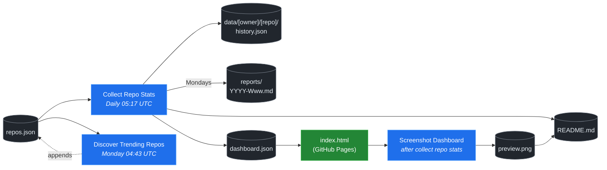

# 🚀 Rising Repos Tracker

> Automatically tracks daily GitHub stats (stars, forks, issues, velocity) for rising open source repos.

**GitHub shows a repo's star count, not how fast it is growing — this keeps a daily history so you can see which repos are actually taking off.** Runs entirely on GitHub Actions + Pages: no server, no database.

**Quick start:** 1. Fork this repo · 2. Delete my `data/` and `reports/`, put the repos you care about in [`repos.json`](./repos.json) · 3. Enable GitHub Pages and run **Collect Repo Stats** once. Details in [Fork & use it for yourself](#fork--use-it-for-yourself).

⭐ If the dashboard is useful to you, a star helps others find it.

[](https://www.telosignal.com/)


**[→ View Live Dashboard](https://patrick-creates.github.io/rising-repos-tracker/)** · **[→ Weekly reports](./reports/README.md)**

Built and maintained by [Telosignal](https://www.telosignal.com/).


<!-- AUTOGEN-STATS-START -->
## 📊 Current snapshot

> Auto-updated daily — last refreshed 2026-11-18

| Metric | Value |
|---|---|
| Repos tracked | **219** (44 stalled 💤) |
| Total stars | **11,851,163** |
| Total forks | **1,720,452** |
| Fastest growing | **rea** ⚠️ (+4596.7/day) |

### 🔥 Top 5 by velocity

> ⚠️ unusually fast growth (1,000+ stars/day over its lifetime and the last week): check before trusting. 💤 stalled repos are left out.

| # | Repo | Stars | Stars/day (30d) |
|---|---|---:|---:|
| 1 | [morluto/rea](https://github.com/morluto/rea) ⚠️ | 467,561 | +4596.7 |
| 2 | [Ebony-Vinyl/dsh-our-free-model](https://github.com/Ebony-Vinyl/dsh-our-free-model) ⚠️ | 79,502 | +1765.1 |
| 3 | [pingdotgg/t3code](https://github.com/pingdotgg/t3code) | 64,815 | +1271.5 |
| 4 | [debpalash/VoiceStudio](https://github.com/debpalash/VoiceStudio) | 113,277 | +1223.8 |
| 5 | [ccch1mneyyy/dsh-Go](https://github.com/ccch1mneyyy/dsh-Go) ⚠️ | 26,850 | +1187.5 |

### 🆕 Recently added

- [pingdotgg/t3code](https://github.com/pingdotgg/t3code) — added 2026-11-16 — The best way to control Claude Code, Codex and more from any computer or phone
- [ccch1mneyyy/dsh-Go](https://github.com/ccch1mneyyy/dsh-Go) — added 2026-11-16 — dsh-go — DeepSeek Harness 装进口袋：手机本机运行，也能遥控你的电脑。
- [DuarteSantos8/openGym](https://github.com/DuarteSantos8/openGym) — added 2026-11-09 — Open-source gym & body-weight tracker, now in the App Store (iPhone + Apple Watch) and as an Android APK. Plan routines, log workouts, see which muscles are trained, import from Strong/Hevy/FitNotes. Self-host it or use it on the phone alone.
<!-- AUTOGEN-STATS-END -->

<!-- AUTOGEN-DIAGRAM-START -->
## 🔄 How it works


```mermaid
graph LR
    repos[("repos.json")]:::data
    history[("data/[owner]/[repo]/<br/>history.json")]:::data
    readme[("README.md")]:::data
    reports[("reports/<br/>YYYY-Www.md")]:::data
    preview[("preview.png")]:::data
    site[("dashboard.json")]:::data
    dashboard["index.html<br/>(GitHub Pages)"]:::output
    collect_yml["Collect Repo Stats<br/><i>Daily 05:17 UTC</i>"]:::workflow
    discover_yml["Discover Trending Repos<br/><i>Monday 04:43 UTC</i>"]:::workflow
    screenshot_yml["Screenshot Dashboard<br/><i>after collect repo stats</i>"]:::workflow
    repos --> collect_yml
    collect_yml --> history
    collect_yml --> readme
    collect_yml --> site
    collect_yml -->|Mondays| reports
    repos --> discover_yml
    discover_yml -.->|appends| repos
    dashboard --> screenshot_yml
    screenshot_yml --> preview
    site --> dashboard
    preview --> readme
    classDef workflow fill:#1f6feb,stroke:#58a6ff,color:#fff
    classDef data fill:#21262d,stroke:#7d8590,color:#e6edf3
    classDef output fill:#238636,stroke:#3fb950,color:#fff
```
<!-- AUTOGEN-DIAGRAM-END -->

<!-- AUTOGEN-WORKFLOWS-START -->
## ⚙️ Workflows

| File | Schedule | Name |
|---|---|---|
| `collect.yml` | Daily 05:17 UTC | Collect Repo Stats |
| `discover.yml` | Monday 04:43 UTC | Discover Trending Repos |
| `screenshot.yml` | After Collect Repo Stats | Screenshot Dashboard |

> All workflows commit results directly back to the repo. Schedules are best-effort — GitHub Actions cron can drift by a few minutes.
<!-- AUTOGEN-WORKFLOWS-END -->

<!-- AUTOGEN-REPOS-START -->
## 📋 All tracked repos

| Repo | Stars | Forks | Stars/day (30d) |
|---|---:|---:|---:|
| [morluto/rea](https://github.com/morluto/rea) ⚠️ | 467,561 | 114,339 | +4596.7 |
| [openclaw/openclaw](https://github.com/openclaw/openclaw) | 394,726 | 82,923 | +76.2 |
| [obra/superpowers](https://github.com/obra/superpowers) | 319,744 | 28,518 | +596.4 |
| [affaan-m/ECC](https://github.com/affaan-m/ECC) | 306,113 | 45,056 | +750.4 |
| [NousResearch/hermes-agent](https://github.com/NousResearch/hermes-agent) | 264,409 | 59,678 | +310.4 |
| [microsoft/markitdown](https://github.com/microsoft/markitdown) | 196,451 | 14,869 | +181.1 |
| [DietrichGebert/ponytail](https://github.com/DietrichGebert/ponytail) | 193,742 | 10,896 | +875.4 |
| [Significant-Gravitas/AutoGPT](https://github.com/Significant-Gravitas/AutoGPT) | 188,082 | 45,863 | +14.4 |
| [f/prompts.chat](https://github.com/f/prompts.chat) | 177,789 | 22,672 | +142.7 |
| [langgenius/dify](https://github.com/langgenius/dify) | 161,420 | 25,522 | +84.9 |
| [open-webui/open-webui](https://github.com/open-webui/open-webui) | 159,016 | 23,108 | +96.0 |
| [farion1231/cc-switch](https://github.com/farion1231/cc-switch) | 155,478 | 10,169 | +309.7 |
| [nextlevelbuilder/ui-ux-pro-max-skill](https://github.com/nextlevelbuilder/ui-ux-pro-max-skill) | 151,176 | 15,972 | +458.3 |
| [github/spec-kit](https://github.com/github/spec-kit) | 150,410 | 13,515 | +284.4 |
| [Graphify-Labs/graphify](https://github.com/Graphify-Labs/graphify) | 149,955 | 14,408 | +708.2 |
| [langchain-ai/langchain](https://github.com/langchain-ai/langchain) | 149,844 | 25,161 | +59.2 |
| [stablyai/orca](https://github.com/stablyai/orca) | 128,519 | 8,149 | +1036.4 |
| [microsoft/generative-ai-for-beginners](https://github.com/microsoft/generative-ai-for-beginners) | 123,798 | 66,641 | +72.7 |
| [JuliusBrussee/caveman](https://github.com/JuliusBrussee/caveman) | 121,208 | 7,084 | +254.8 |
| [Leonxlnx/taste-skill](https://github.com/Leonxlnx/taste-skill) | 118,160 | 7,908 | +635.4 |
| [thedotmack/claude-mem](https://github.com/thedotmack/claude-mem) | 118,149 | 10,268 | +548.1 |
| [paperclipai/paperclip](https://github.com/paperclipai/paperclip) | 114,715 | 19,040 | +343.6 |
| [debpalash/VoiceStudio](https://github.com/debpalash/VoiceStudio) | 113,277 | 12,590 | +1223.8 |
| [Panniantong/Agent-Reach](https://github.com/Panniantong/Agent-Reach) | 112,968 | 10,132 | +453.8 |
| [pbakaus/impeccable](https://github.com/pbakaus/impeccable) | 112,644 | 6,711 | +787.5 |
| [nexu-io/open-design](https://github.com/nexu-io/open-design) | 108,260 | 12,286 | +196.2 |
| [ruvnet/RuView](https://github.com/ruvnet/RuView) | 104,562 | 13,593 | +194.5 |
| [tt-a1i/archify](https://github.com/tt-a1i/archify) | 97,656 | 6,666 | +401.1 |
| [vllm-project/vllm](https://github.com/vllm-project/vllm) | 97,159 | 24,974 | +101.3 |
| [OpenHands/OpenHands](https://github.com/OpenHands/OpenHands) | 93,736 | 12,551 | +82.8 |
| [koala73/worldmonitor](https://github.com/koala73/worldmonitor) | 90,880 | 14,106 | +69.3 |
| [ChatGPTNextWeb/NextChat](https://github.com/ChatGPTNextWeb/NextChat) 💤 | 88,974 | 58,484 | +3.6 |
| [cheaper-inference/OmniRoute](https://github.com/cheaper-inference/OmniRoute) | 88,557 | 13,635 | +341.8 |
| [datawhalechina/hello-agents](https://github.com/datawhalechina/hello-agents) | 87,317 | 10,915 | +120.6 |
| [rtk-ai/rtk](https://github.com/rtk-ai/rtk) | 87,030 | 5,589 | +103.3 |
| [heygen-com/hyperframes](https://github.com/heygen-com/hyperframes) | 86,302 | 8,000 | +637.7 |
| [lobehub/lobehub](https://github.com/lobehub/lobehub) | 85,767 | 16,345 | +81.6 |
| [career-ops-hq/career-ops](https://github.com/career-ops-hq/career-ops) | 83,479 | 15,315 | +263.6 |
| [ruvnet/ruflo](https://github.com/ruvnet/ruflo) | 82,014 | 9,677 | +173.3 |
| [OpenMontageInc/OpenMontage](https://github.com/OpenMontageInc/OpenMontage) | 81,474 | 11,073 | +391.8 |
| [shareAI-lab/learn-claude-code](https://github.com/shareAI-lab/learn-claude-code) | 80,590 | 12,884 | +59.2 |
| [dair-ai/Prompt-Engineering-Guide](https://github.com/dair-ai/Prompt-Engineering-Guide) | 80,178 | 8,788 | +28.3 |
| [headroomlabs-ai/headroom](https://github.com/headroomlabs-ai/headroom) | 79,990 | 6,271 | +134.5 |
| [ComposioHQ/awesome-claude-skills](https://github.com/ComposioHQ/awesome-claude-skills) | 79,784 | 9,779 | +79.0 |
| [unslothai/unsloth](https://github.com/unslothai/unsloth) | 79,729 | 7,443 | +49.5 |
| [Ebony-Vinyl/dsh-our-free-model](https://github.com/Ebony-Vinyl/dsh-our-free-model) ⚠️ | 79,502 | 2,240 | +1765.1 |
| [rohitg00/ai-engineering-from-scratch](https://github.com/rohitg00/ai-engineering-from-scratch) | 79,438 | 14,183 | +273.4 |
| [openai/openai-cookbook](https://github.com/openai/openai-cookbook) | 77,229 | 13,074 | +18.0 |
| [usestrix/strix](https://github.com/usestrix/strix) | 76,434 | 8,685 | +221.3 |
| [Fission-AI/OpenSpec](https://github.com/Fission-AI/OpenSpec) | 75,151 | 5,156 | +92.3 |
| [ZhuLinsen/daily_stock_analysis](https://github.com/ZhuLinsen/daily_stock_analysis) | 73,276 | 57,868 | +218.3 |
| [ai-job-search-dev/ai-job-search](https://github.com/ai-job-search-dev/ai-job-search) | 72,380 | 23,260 | +577.8 |
| [asgeirtj/system_prompts_leaks](https://github.com/asgeirtj/system_prompts_leaks) | 71,686 | 11,528 | +59.9 |
| [code-yeongyu/oh-my-openagent](https://github.com/code-yeongyu/oh-my-openagent) | 70,986 | 5,844 | +26.9 |
| [blader/humanizer](https://github.com/blader/humanizer) | 70,657 | 5,548 | +412.0 |
| [mvanhorn/last30days-skill](https://github.com/mvanhorn/last30days-skill) | 69,644 | 6,211 | +164.4 |
| [shanraisshan/claude-code-best-practice](https://github.com/shanraisshan/claude-code-best-practice) | 69,197 | 6,881 | +48.9 |
| [xtekky/gpt4free](https://github.com/xtekky/gpt4free) 💤 | 67,081 | 13,454 | +6.2 |
| [pingdotgg/t3code](https://github.com/pingdotgg/t3code) | 64,815 | 11,371 | +1271.5 |
| [tw93/Pake](https://github.com/tw93/Pake) | 63,789 | 13,039 | +53.5 |
| [BerriAI/litellm](https://github.com/BerriAI/litellm) | 63,479 | 13,387 | +64.2 |
| [coreyhaines31/marketingskills](https://github.com/coreyhaines31/marketingskills) | 61,158 | 8,924 | +190.1 |
| [jamiepine/voicebox](https://github.com/jamiepine/voicebox) | 60,876 | 7,661 | +96.4 |
| [MemPalace/mempalace](https://github.com/MemPalace/mempalace) | 60,602 | 7,674 | +32.3 |
| [router-for-me/CLIProxyAPI](https://github.com/router-for-me/CLIProxyAPI) | 58,926 | 9,029 | +108.6 |
| [bojieli/ai-agent-book](https://github.com/bojieli/ai-agent-book) | 58,663 | 6,865 | +124.8 |
| [hesreallyhim/awesome-claude-code](https://github.com/hesreallyhim/awesome-claude-code) | 58,277 | 4,975 | +76.1 |
| [ChromeDevTools/chrome-devtools-mcp](https://github.com/ChromeDevTools/chrome-devtools-mcp) | 58,161 | 4,874 | +144.6 |
| [K-Dense-AI/scientific-agent-skills](https://github.com/K-Dense-AI/scientific-agent-skills) | 57,662 | 5,069 | +162.9 |
| [Imbad0202/academic-research-skills](https://github.com/Imbad0202/academic-research-skills) | 57,460 | 4,367 | +151.9 |
| [FlowiseAI/Flowise](https://github.com/FlowiseAI/Flowise) 💤 | 55,576 | 25,091 | +2.2 |
| [ggml-org/whisper.cpp](https://github.com/ggml-org/whisper.cpp) | 55,290 | 6,322 | +27.0 |
| [alibaba/open-code-review](https://github.com/alibaba/open-code-review) | 54,101 | 4,471 | +215.7 |
| [elder-plinius/CL4R1T4S](https://github.com/elder-plinius/CL4R1T4S) | 53,660 | 11,213 | +76.5 |
| [obsidianmd/obsidian-skills](https://github.com/obsidianmd/obsidian-skills) | 53,148 | 3,777 | +112.9 |
| [QuantumNous/new-api](https://github.com/QuantumNous/new-api) | 52,157 | 12,731 | +63.9 |
| [herdrdev/herdr](https://github.com/herdrdev/herdr) | 51,701 | 4,182 | +232.1 |
| [HKUDS/nanobot](https://github.com/HKUDS/nanobot) | 50,178 | 8,760 | +33.5 |
| [Aider-AI/aider](https://github.com/Aider-AI/aider) | 50,164 | 5,176 | +17.8 |
| [sickn33/agentic-awesome-skills](https://github.com/sickn33/agentic-awesome-skills) | 49,934 | 7,234 | +66.7 |
| [DeusData/codebase-memory-mcp](https://github.com/DeusData/codebase-memory-mcp) | 48,818 | 4,054 | +63.9 |
| [zhayujie/CowAgent](https://github.com/zhayujie/CowAgent) | 47,992 | 10,435 | +17.6 |
| [anthropics/claude-plugins-official](https://github.com/anthropics/claude-plugins-official) | 47,623 | 4,945 | +153.0 |
| [LibreChat-AI/LibreChat](https://github.com/LibreChat-AI/LibreChat) | 47,317 | 9,743 | +45.1 |
| [AstrBotDevs/AstrBot](https://github.com/AstrBotDevs/AstrBot) | 47,152 | 3,614 | +165.1 |
| [ifixai-ai/iFixAi](https://github.com/ifixai-ai/iFixAi) | 46,507 | 1,833 | +557.0 |
| [chatanywhere/GPT_API_free](https://github.com/chatanywhere/GPT_API_free) | 46,297 | 2,780 | +60.0 |
| [langchain-ai/langgraph](https://github.com/langchain-ai/langgraph) | 45,110 | 7,786 | +53.9 |
| [tinyhumansai/openhuman](https://github.com/tinyhumansai/openhuman) | 42,744 | 4,220 | +19.6 |
| [wshobson/agents](https://github.com/wshobson/agents) | 42,649 | 4,508 | +52.4 |
| [volcengine/OpenViking](https://github.com/volcengine/OpenViking) | 42,416 | 3,511 | +69.7 |
| [chatboxai/chatbox](https://github.com/chatboxai/chatbox) | 42,412 | 4,340 | +11.3 |
| [p-e-w/heretic](https://github.com/p-e-w/heretic) | 41,840 | 5,081 | +200.2 |
| [github/awesome-copilot](https://github.com/github/awesome-copilot) | 41,309 | 5,382 | +37.7 |
| [codewhale-hq/Codewhale](https://github.com/codewhale-hq/Codewhale) 💤 | 41,181 | 3,572 | +2.7 |
| [Yeachan-Heo/oh-my-claudecode](https://github.com/Yeachan-Heo/oh-my-claudecode) | 40,922 | 3,651 | +28.8 |
| [mindsdb/mindshub](https://github.com/mindsdb/mindshub) 💤 | 39,864 | 6,228 | +2.1 |
| [JCodesMore/ai-website-cloner-template](https://github.com/JCodesMore/ai-website-cloner-template) | 39,433 | 5,880 | +81.2 |
| [can1357/oh-my-pi](https://github.com/can1357/oh-my-pi) | 39,386 | 4,508 | +115.7 |
| [google/langextract](https://github.com/google/langextract) | 39,340 | 2,756 | +12.2 |
| [AlexsJones/llmfit](https://github.com/AlexsJones/llmfit) | 39,074 | 2,529 | +32.2 |
| [yetone/magpie](https://github.com/yetone/magpie) | 38,534 | 3,489 | +711.4 |
| [PDFMathTranslate/PDFMathTranslate](https://github.com/PDFMathTranslate/PDFMathTranslate) | 38,513 | 3,454 | +28.1 |
| [HKUDS/Vibe-Trading](https://github.com/HKUDS/Vibe-Trading) | 38,479 | 6,264 | +86.6 |
| [virgiliojr94/book-to-skill](https://github.com/virgiliojr94/book-to-skill) | 38,364 | 4,082 | +101.5 |
| [agentscope-ai/QwenPaw](https://github.com/agentscope-ai/QwenPaw) | 37,926 | 3,291 | +69.2 |
| [Tencent/WeKnora](https://github.com/Tencent/WeKnora) | 37,738 | 5,246 | +101.5 |
| [songquanpeng/one-api](https://github.com/songquanpeng/one-api) 💤 | 37,441 | 6,885 | +8.1 |
| [mukul975/Anthropic-Cybersecurity-Skills](https://github.com/mukul975/Anthropic-Cybersecurity-Skills) | 36,348 | 4,443 | +55.3 |
| [esengine/DeepSeek-Reasonix](https://github.com/esengine/DeepSeek-Reasonix) 💤 | 36,105 | 2,586 | +8.1 |
| [Twigpine/openclaude](https://github.com/Twigpine/openclaude) | 34,416 | 9,116 | +13.6 |
| [iOfficeAI/AionUi](https://github.com/iOfficeAI/AionUi) | 34,360 | 3,595 | +24.3 |
| [mksglu/context-mode](https://github.com/mksglu/context-mode) | 34,266 | 2,351 | +111.9 |
| [iOfficeAI/OfficeCLI](https://github.com/iOfficeAI/OfficeCLI) | 33,425 | 2,284 | +41.8 |
| [zeroclaw-labs/zeroclaw](https://github.com/zeroclaw-labs/zeroclaw) | 33,403 | 5,020 | +13.5 |
| [tirth8205/code-review-graph](https://github.com/tirth8205/code-review-graph) | 32,840 | 2,985 | +19.5 |
| [decolua/9router](https://github.com/decolua/9router) | 32,599 | 6,392 | +51.6 |
| [googleworkspace/cli](https://github.com/googleworkspace/cli) | 32,384 | 1,998 | +23.7 |
| [langchain-ai/deepagents](https://github.com/langchain-ai/deepagents) | 31,396 | 4,432 | +32.9 |
| [jackwener/OpenCLI](https://github.com/jackwener/OpenCLI) | 31,159 | 3,047 | +24.2 |
| [TencentCloud/TencentDB-Agent-Memory](https://github.com/TencentCloud/TencentDB-Agent-Memory) | 31,004 | 3,032 | +46.4 |
| [t8y2/dbx](https://github.com/t8y2/dbx) | 30,748 | 2,801 | +117.7 |
| [AgriciDaniel/claude-seo](https://github.com/AgriciDaniel/claude-seo) | 30,562 | 3,815 | +378.0 |
| [hypit-ai/hypit](https://github.com/hypit-ai/hypit) | 30,556 | 3,594 | +225.6 |
| [rohitg00/agentmemory](https://github.com/rohitg00/agentmemory) | 30,447 | 2,711 | +25.9 |
| [alibaba/page-agent](https://github.com/alibaba/page-agent) 💤 | 29,713 | 2,649 | +7.1 |
| [jarrodwatts/claude-hud](https://github.com/jarrodwatts/claude-hud) | 29,242 | 1,340 | +19.9 |
| [manaflow-ai/cmux](https://github.com/manaflow-ai/cmux) | 28,821 | 2,680 | +18.6 |
| [BloopAI/vibe-kanban](https://github.com/BloopAI/vibe-kanban) | 28,727 | 3,065 | +11.2 |
| [voideditor/void](https://github.com/voideditor/void) 💤 | 28,708 | 2,661 | — |
| [every-app/open-seo](https://github.com/every-app/open-seo) | 28,174 | 3,977 | +135.9 |
| [guillaumemeyer/watermarks-remover](https://github.com/guillaumemeyer/watermarks-remover) | 27,741 | 3,133 | +110.9 |
| [ccch1mneyyy/dsh-Go](https://github.com/ccch1mneyyy/dsh-Go) ⚠️ | 26,850 | 1,289 | +1187.5 |
| [NVIDIA/SkillSpector](https://github.com/NVIDIA/SkillSpector) | 26,729 | 2,381 | +206.7 |
| [zai-org/Open-AutoGLM](https://github.com/zai-org/Open-AutoGLM) 💤 | 26,624 | 4,066 | +6.4 |
| [toon-format/toon](https://github.com/toon-format/toon) 💤 | 25,638 | 1,126 | +3.9 |
| [pascalorg/editor](https://github.com/pascalorg/editor) | 25,603 | 3,182 | +20.9 |
| [walkinglabs/learn-harness-engineering](https://github.com/walkinglabs/learn-harness-engineering) | 25,395 | 2,913 | +151.6 |
| [vercel-labs/agent-desktop](https://github.com/vercel-labs/agent-desktop) | 25,199 | 1,885 | +567.3 |
| [jundot/omlx](https://github.com/jundot/omlx) | 23,725 | 2,150 | +26.9 |
| [steipete/CodexBar](https://github.com/steipete/CodexBar) | 23,209 | 2,238 | +18.8 |
| [pranshuparmar/witr](https://github.com/pranshuparmar/witr) | 23,036 | 812 | +10.6 |
| [DuarteSantos8/openGym](https://github.com/DuarteSantos8/openGym) | 22,671 | 3,011 | +239.4 |
| [winfunc/opcode](https://github.com/winfunc/opcode) 💤 | 22,454 | 1,702 | +1.3 |
| [KKKKhazix/khazix-skills](https://github.com/KKKKhazix/khazix-skills) | 22,385 | 2,351 | +29.3 |
| [jnMetaCode/agency-agents-zh](https://github.com/jnMetaCode/agency-agents-zh) | 22,168 | 3,556 | +27.0 |
| [NirDiamant/agents-towards-production](https://github.com/NirDiamant/agents-towards-production) 💤 | 21,920 | 2,893 | +6.4 |
| [1jehuang/jcode](https://github.com/1jehuang/jcode) | 21,880 | 2,549 | +28.5 |
| [coze-dev/coze-studio](https://github.com/coze-dev/coze-studio) 💤 | 21,817 | 3,141 | +2.9 |
| [datawhalechina/easy-vibe](https://github.com/datawhalechina/easy-vibe) | 20,463 | 1,975 | +15.1 |
| [jlcodes99/cockpit-tools](https://github.com/jlcodes99/cockpit-tools) | 20,107 | 1,825 | +33.6 |
| [rocketride-org/rocketride-server](https://github.com/rocketride-org/rocketride-server) | 20,020 | 8,686 | +76.0 |
| [danielmiessler/LifeOS](https://github.com/danielmiessler/LifeOS) | 19,926 | 2,528 | +13.8 |
| [tanweai/pua](https://github.com/tanweai/pua) 💤 | 19,863 | 1,206 | +4.8 |
| [dataelement/dsh-desktop](https://github.com/dataelement/dsh-desktop) | 19,814 | 673 | +144.6 |
| [nesquena/hermes-webui](https://github.com/nesquena/hermes-webui) | 19,558 | 2,842 | +17.6 |
| [wanshuiyin/Auto-claude-code-research-in-sleep](https://github.com/wanshuiyin/Auto-claude-code-research-in-sleep) | 19,429 | 1,559 | +57.5 |
| [xerj-org/xerj](https://github.com/xerj-org/xerj) | 19,229 | 1,445 | +153.0 |
| [browser-use/browser-harness](https://github.com/browser-use/browser-harness) | 19,146 | 1,895 | +21.7 |
| [microsoft/agent-lightning](https://github.com/microsoft/agent-lightning) 💤 | 18,974 | 1,723 | +7.3 |
| [RightNow-AI/openfang](https://github.com/RightNow-AI/openfang) 💤 | 18,265 | 2,282 | +1.8 |
| [tradecatlabs/vibe-coding-cn](https://github.com/tradecatlabs/vibe-coding-cn) | 17,751 | 1,791 | +36.1 |
| [MemoriLabs/Memori](https://github.com/MemoriLabs/Memori) | 17,595 | 4,003 | +14.9 |
| [composio-community/awesome-codex-skills](https://github.com/composio-community/awesome-codex-skills) | 17,357 | 1,782 | +13.4 |
| [xpzouying/xiaohongshu-mcp](https://github.com/xpzouying/xiaohongshu-mcp) | 17,198 | 2,533 | +27.4 |
| [xbtlin/ai-berkshire](https://github.com/xbtlin/ai-berkshire) | 17,186 | 2,535 | +12.9 |
| [cft0808/edict](https://github.com/cft0808/edict) 💤 | 17,079 | 1,770 | +2.6 |
| [ParadevAI/Paradev](https://github.com/ParadevAI/Paradev) | 16,379 | 1,471 | +34.2 |
| [Anionex/banana-slides](https://github.com/Anionex/banana-slides) 💤 | 16,030 | 1,801 | +8.2 |
| [NanmiCoder/cc-haha](https://github.com/NanmiCoder/cc-haha) | 15,489 | 8,618 | +13.9 |
| [ConardLi/garden-skills](https://github.com/ConardLi/garden-skills) | 15,435 | 1,750 | +81.2 |
| [yusufkaraaslan/Skill_Seekers](https://github.com/yusufkaraaslan/Skill_Seekers) 💤 | 15,338 | 1,564 | +5.2 |
| [kyegomez/OpenMythos](https://github.com/kyegomez/OpenMythos) 💤 | 14,929 | 3,267 | +0.7 |
| [NevaMind-AI/memU](https://github.com/NevaMind-AI/memU) 💤 | 14,627 | 1,104 | +2.4 |
| [openai/codex-security](https://github.com/openai/codex-security) | 14,049 | 1,096 | +97.1 |
| [EverMind-AI/EverOS](https://github.com/EverMind-AI/EverOS) | 13,937 | 978 | +14.9 |
| [OpenByteInc/QuantDinger](https://github.com/OpenByteInc/QuantDinger) | 13,847 | 2,822 | +31.1 |
| [XiaomiMiMo/MiMo-Code](https://github.com/XiaomiMiMo/MiMo-Code) 💤 | 13,793 | 1,478 | +3.4 |
| [0x4m4/hexstrike-ai](https://github.com/0x4m4/hexstrike-ai) | 13,715 | 2,802 | +26.0 |
| [sirmalloc/ccstatusline](https://github.com/sirmalloc/ccstatusline) | 13,633 | 612 | +10.0 |
| [Tracer-Cloud/opensre](https://github.com/Tracer-Cloud/opensre) | 12,865 | 1,888 | +12.9 |
| [genspark-ai/genoffice](https://github.com/genspark-ai/genoffice) | 12,583 | 1,757 | +86.2 |
| [MemTensor/MemOS](https://github.com/MemTensor/MemOS) | 12,445 | 1,128 | +17.2 |
| [TencentCloud/Octop](https://github.com/TencentCloud/Octop) | 12,211 | 1,728 | +70.9 |
| [Nasiko-Labs/nasiko](https://github.com/Nasiko-Labs/nasiko) | 11,956 | 3,241 | +83.0 |
| [getagentseal/codeburn](https://github.com/getagentseal/codeburn) | 11,859 | 913 | +11.4 |
| [EKKOLearnAI/ekko-studio](https://github.com/EKKOLearnAI/ekko-studio) | 11,793 | 1,479 | +10.7 |
| [holaboss-ai/holaOS](https://github.com/holaboss-ai/holaOS) 💤 | 11,450 | 728 | — |
| [trailhq/Trail-Code](https://github.com/trailhq/Trail-Code) | 11,330 | 1,021 | +30.1 |
| [aden-hive/hive](https://github.com/aden-hive/hive) 💤 | 11,168 | 5,631 | +2.0 |
| [ValueCell-ai/valuecell](https://github.com/ValueCell-ai/valuecell) 💤 | 11,060 | 1,807 | +1.1 |
| [StarTrail-org/PixelRAG](https://github.com/StarTrail-org/PixelRAG) | 10,966 | 987 | +21.9 |
| [MakazhanAlpamys/Soup](https://github.com/MakazhanAlpamys/Soup) | 10,629 | 1,765 | +41.3 |
| [Tencent/BrowserSkill](https://github.com/Tencent/BrowserSkill) | 10,548 | 762 | +44.9 |
| [ykdojo/claude-code-tips](https://github.com/ykdojo/claude-code-tips) 💤 | 10,357 | 824 | +3.6 |
| [Kuberwastaken/claurst](https://github.com/Kuberwastaken/claurst) 💤 | 10,347 | 7,644 | +0.7 |
| [makecindy/cindy](https://github.com/makecindy/cindy) | 10,283 | 1,301 | +80.9 |
| [Companion-Inc/feynman](https://github.com/Companion-Inc/feynman) 💤 | 10,132 | 1,111 | +4.9 |
| [modem-dev/hunk](https://github.com/modem-dev/hunk) 💤 | 9,843 | 336 | +6.9 |
| [Jakeschincariol/replica-skill](https://github.com/Jakeschincariol/replica-skill) | 9,806 | 1,797 | +135.9 |
| [open-slide/open-slide](https://github.com/open-slide/open-slide) | 9,803 | 718 | +16.6 |
| [frankbria/ralph-claude-code](https://github.com/frankbria/ralph-claude-code) 💤 | 9,736 | 728 | +1.0 |
| [iflytek/astron-agent](https://github.com/iflytek/astron-agent) 💤 | 8,939 | 912 | +0.9 |
| [WenyuChiou/awesome-agentic-ai-zh](https://github.com/WenyuChiou/awesome-agentic-ai-zh) | 8,813 | 1,090 | +36.1 |
| [EvoMap/evolver](https://github.com/EvoMap/evolver) 💤 | 8,749 | 854 | +2.1 |
| [MiroMindAI/MiroThinker](https://github.com/MiroMindAI/MiroThinker) 💤 | 8,455 | 648 | +1.1 |
| [rorkai/App-Store-Connect-CLI](https://github.com/rorkai/App-Store-Connect-CLI) | 8,410 | 740 | +14.5 |
| [JetBrains/thinkrail](https://github.com/JetBrains/thinkrail) | 8,345 | 531 | +34.4 |
| [mmulet/term.everything](https://github.com/mmulet/term.everything) 💤 | 8,123 | 197 | +0.2 |
| [ValueCell-ai/ClawX](https://github.com/ValueCell-ai/ClawX) 💤 | 7,595 | 1,136 | — |
| [ZSeven-W/openpencil](https://github.com/ZSeven-W/openpencil) | 7,275 | 638 | +25.3 |
| [tech-leads-club/agent-skills](https://github.com/tech-leads-club/agent-skills) 💤 | 7,177 | 568 | +3.5 |
| [TokenRhythm/opensquilla](https://github.com/TokenRhythm/opensquilla) 💤 | 7,162 | 596 | +1.7 |
| [steipete/summarize](https://github.com/steipete/summarize) 💤 | 6,864 | 462 | +4.8 |
| [Andyyyy64/whichllm](https://github.com/Andyyyy64/whichllm) 💤 | 6,841 | 379 | +2.5 |
| [Arthur-Ficial/apfel](https://github.com/Arthur-Ficial/apfel) 💤 | 6,612 | 252 | +3.8 |
| [microsoft/fara](https://github.com/microsoft/fara) 💤 | 6,258 | 608 | +1.2 |
| [UfoMiao/zcf](https://github.com/UfoMiao/zcf) 💤 | 6,070 | 418 | — |
| [re4/LibreCode](https://github.com/re4/LibreCode) 💤 | 86 | 4 | — |
<!-- AUTOGEN-REPOS-END -->

---

## What it does

- Collects daily snapshots of stars, forks, watchers and open issues for every tracked repo
- Discovers new trending repos automatically every Monday using the GitHub Search API
- Shows each repo's GitHub description and topics in the dashboard, refreshed with every daily snapshot
- Writes a weekly report every Monday to [`reports/`](./reports/README.md): top 10 by stars gained, top 10 by growth rate, newly tracked repos; unusual jumps (over 50% in a week or 25% in a day) are marked ⚠️
- Stores all history as plain JSON — no database, no backend
- Renders a live dashboard via GitHub Pages — updates daily, zero maintenance

Star counts come from the GitHub API as they are. A viral launch, bulk starring or a repo rename can all show up as a jump; check the repo before quoting a number.

## Tracked repos

Data lives in [`data/`](./data) — one folder per repo, one `history.json` per entry.  
The full watch list is in [`repos.json`](./repos.json).

## Fork & use it for yourself

This is my personal tracker — the watch list reflects what I find interesting. If you want to track different repos, the best path is to **fork this repo and run your own**.

### Setup

1. Fork this repo to your account
2. Clear my data and set your own watch list. The fork brings my full history (one folder per repo in `data/`, plus `reports/`), which would mix into your charts:
   ```bash
   git rm -r -q data reports
   ```
   Then replace the contents of [`repos.json`](./repos.json) with the repos you want to track (or leave one entry — `discover.yml` auto-adds more every Monday) and commit.
3. Go to **Settings → Pages** and enable GitHub Pages from the `main` branch
4. Go to **Actions**, enable workflows (GitHub disables them on forks by default) and run **Collect Repo Stats** once manually to seed your first data point
5. Your dashboard will be live at `https://YOUR-USERNAME.github.io/rising-repos-tracker/`

That's it — daily collection, weekly discovery and the Monday report run automatically on schedule. Zero ongoing maintenance.

### Repo descriptions

Clicking a repo in the dashboard shows its GitHub description and topics, taken from the daily snapshot. Until 2026 the tracker also generated AI summaries with GitHub Models; GitHub retired that service on 2026-07-30. The summaries generated before then stay in `data/<owner>/<repo>/summary.json` and are shown below the description, dated; no new ones are generated.

### Customizing what gets discovered

Edit [`scripts/discover.js`](./scripts/discover.js) to change:

- `MIN_STARS` — minimum star threshold for candidates
- `MAX_AGE_DAYS` — how recent a repo must be
- `MAX_NEW_REPOS` — how many to add per discovery run
- The `queries` array — GitHub Search API queries that define what "trending" means to you

### Adding a repo manually

Just edit `repos.json` directly:

```json
{
  "owner": "OWNER",
  "repo": "REPO",
  "added": "YYYY-MM-DD",
  "notes": "why you're tracking this",
  "created_at": "YYYY-MM-DD"
}
```

`created_at` (the repo's creation date) is optional; without it the repo only shows under "all ages" in the dashboard's age filter. The next daily collect run picks it up automatically.

## Stack

- **GitHub Actions** — scheduling and automation
- **GitHub Pages** — dashboard hosting
- **GitHub API** — data source
- **Chart.js** — star growth visualization
- **Mermaid** — architecture diagram (rendered by GitHub)
- Collecting, reports and README use Node built-ins only; the screenshot workflow installs Puppeteer. No build step, no database

## License

MIT
