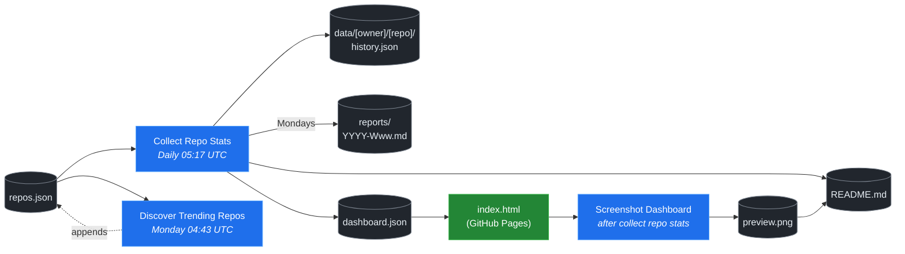

# 🚀 Rising Repos Tracker

> Automatically tracks daily GitHub stats (stars, forks, issues, velocity) for rising open source repos.

**GitHub shows a repo's star count, not how fast it is growing — this keeps a daily history so you can see which repos are actually taking off.** Runs entirely on GitHub Actions + Pages: no server, no database.

**Quick start:** 1. Fork this repo · 2. Delete my `data/` and `reports/`, put the repos you care about in [`repos.json`](./repos.json) · 3. Enable GitHub Pages and run **Collect Repo Stats** once. Details in [Fork & use it for yourself](#fork--use-it-for-yourself).

⭐ If the dashboard is useful to you, a star helps others find it.

[](https://www.telosignal.com/)


**[→ View Live Dashboard](https://patrick-creates.github.io/rising-repos-tracker/)** · **[→ Weekly reports](./reports/README.md)**

Built and maintained by [Telosignal](https://www.telosignal.com/).


<!-- AUTOGEN-STATS-START -->
## 📊 Current snapshot

> Auto-updated daily — last refreshed 2026-11-20

| Metric | Value |
|---|---|
| Repos tracked | **219** (45 stalled 💤) |
| Total stars | **11,902,481** |
| Total forks | **1,726,431** |
| Fastest growing | **rea** ⚠️ (+3946.2/day) |

### 🔥 Top 5 by velocity

> ⚠️ unusually fast growth (1,000+ stars/day over its lifetime and the last week): check before trusting. 💤 stalled repos are left out.

| # | Repo | Stars | Stars/day (30d) |
|---|---|---:|---:|
| 1 | [morluto/rea](https://github.com/morluto/rea) ⚠️ | 470,948 | +3946.2 |
| 2 | [Ebony-Vinyl/dsh-our-free-model](https://github.com/Ebony-Vinyl/dsh-our-free-model) ⚠️ | 81,820 | +1652.8 |
| 3 | [pingdotgg/t3code](https://github.com/pingdotgg/t3code) | 67,219 | +1236.8 |
| 4 | [debpalash/VoiceStudio](https://github.com/debpalash/VoiceStudio) | 115,118 | +1185.6 |
| 5 | [ccch1mneyyy/dsh-Go](https://github.com/ccch1mneyyy/dsh-Go) ⚠️ | 28,787 | +1078.0 |

### 🆕 Recently added

- [pingdotgg/t3code](https://github.com/pingdotgg/t3code) — added 2026-11-16 — The best way to control Claude Code, Codex and more from any computer or phone
- [ccch1mneyyy/dsh-Go](https://github.com/ccch1mneyyy/dsh-Go) — added 2026-11-16 — dsh-go — DeepSeek Harness 装进口袋：手机本机运行，也能遥控你的电脑。
- [DuarteSantos8/openGym](https://github.com/DuarteSantos8/openGym) — added 2026-11-09 — Open-source gym & body-weight tracker, now in the App Store (iPhone + Apple Watch) and as an Android APK. Plan routines, log workouts, see which muscles are trained, import from Strong/Hevy/FitNotes. Self-host it or use it on the phone alone.
<!-- AUTOGEN-STATS-END -->

<!-- AUTOGEN-DIAGRAM-START -->
## 🔄 How it works


```mermaid
graph LR
    repos[("repos.json")]:::data
    history[("data/[owner]/[repo]/<br/>history.json")]:::data
    readme[("README.md")]:::data
    reports[("reports/<br/>YYYY-Www.md")]:::data
    preview[("preview.png")]:::data
    site[("dashboard.json")]:::data
    dashboard["index.html<br/>(GitHub Pages)"]:::output
    collect_yml["Collect Repo Stats<br/><i>Daily 05:17 UTC</i>"]:::workflow
    discover_yml["Discover Trending Repos<br/><i>Monday 04:43 UTC</i>"]:::workflow
    screenshot_yml["Screenshot Dashboard<br/><i>after collect repo stats</i>"]:::workflow
    repos --> collect_yml
    collect_yml --> history
    collect_yml --> readme
    collect_yml --> site
    collect_yml -->|Mondays| reports
    repos --> discover_yml
    discover_yml -.->|appends| repos
    dashboard --> screenshot_yml
    screenshot_yml --> preview
    site --> dashboard
    preview --> readme
    classDef workflow fill:#1f6feb,stroke:#58a6ff,color:#fff
    classDef data fill:#21262d,stroke:#7d8590,color:#e6edf3
    classDef output fill:#238636,stroke:#3fb950,color:#fff
```
<!-- AUTOGEN-DIAGRAM-END -->

<!-- AUTOGEN-WORKFLOWS-START -->
## ⚙️ Workflows

| File | Schedule | Name |
|---|---|---|
| `collect.yml` | Daily 05:17 UTC | Collect Repo Stats |
| `discover.yml` | Monday 04:43 UTC | Discover Trending Repos |
| `screenshot.yml` | After Collect Repo Stats | Screenshot Dashboard |

> All workflows commit results directly back to the repo. Schedules are best-effort — GitHub Actions cron can drift by a few minutes.
<!-- AUTOGEN-WORKFLOWS-END -->

<!-- AUTOGEN-REPOS-START -->
## 📋 All tracked repos

| Repo | Stars | Forks | Stars/day (30d) |
|---|---:|---:|---:|
| [morluto/rea](https://github.com/morluto/rea) ⚠️ | 470,948 | 115,011 | +3946.2 |
| [openclaw/openclaw](https://github.com/openclaw/openclaw) | 394,891 | 82,941 | +74.9 |
| [obra/superpowers](https://github.com/obra/superpowers) | 322,554 | 28,655 | +657.9 |
| [affaan-m/ECC](https://github.com/affaan-m/ECC) | 307,565 | 45,276 | +746.8 |
| [NousResearch/hermes-agent](https://github.com/NousResearch/hermes-agent) | 264,894 | 59,837 | +305.6 |
| [microsoft/markitdown](https://github.com/microsoft/markitdown) | 197,183 | 14,936 | +193.3 |
| [DietrichGebert/ponytail](https://github.com/DietrichGebert/ponytail) | 195,304 | 11,009 | +825.3 |
| [Significant-Gravitas/AutoGPT](https://github.com/Significant-Gravitas/AutoGPT) | 188,118 | 45,849 | +14.3 |
| [f/prompts.chat](https://github.com/f/prompts.chat) | 177,952 | 22,694 | +139.3 |
| [langgenius/dify](https://github.com/langgenius/dify) | 161,564 | 25,546 | +81.7 |
| [open-webui/open-webui](https://github.com/open-webui/open-webui) | 159,143 | 23,124 | +93.4 |
| [farion1231/cc-switch](https://github.com/farion1231/cc-switch) | 155,997 | 10,205 | +297.6 |
| [nextlevelbuilder/ui-ux-pro-max-skill](https://github.com/nextlevelbuilder/ui-ux-pro-max-skill) | 152,026 | 16,048 | +460.8 |
| [Graphify-Labs/graphify](https://github.com/Graphify-Labs/graphify) | 150,947 | 14,528 | +671.6 |
| [github/spec-kit](https://github.com/github/spec-kit) | 150,779 | 13,547 | +284.7 |
| [langchain-ai/langchain](https://github.com/langchain-ai/langchain) | 149,964 | 25,159 | +59.3 |
| [stablyai/orca](https://github.com/stablyai/orca) | 130,586 | 8,311 | +1006.2 |
| [microsoft/generative-ai-for-beginners](https://github.com/microsoft/generative-ai-for-beginners) | 123,900 | 66,741 | +70.1 |
| [JuliusBrussee/caveman](https://github.com/JuliusBrussee/caveman) | 121,704 | 7,116 | +257.8 |
| [Leonxlnx/taste-skill](https://github.com/Leonxlnx/taste-skill) | 119,165 | 7,980 | +634.3 |
| [thedotmack/claude-mem](https://github.com/thedotmack/claude-mem) | 118,561 | 10,315 | +550.6 |
| [paperclipai/paperclip](https://github.com/paperclipai/paperclip) | 115,368 | 19,152 | +331.8 |
| [debpalash/VoiceStudio](https://github.com/debpalash/VoiceStudio) | 115,118 | 12,809 | +1185.6 |
| [pbakaus/impeccable](https://github.com/pbakaus/impeccable) | 113,805 | 6,777 | +764.5 |
| [Panniantong/Agent-Reach](https://github.com/Panniantong/Agent-Reach) | 113,482 | 10,201 | +434.8 |
| [nexu-io/open-design](https://github.com/nexu-io/open-design) | 108,627 | 12,312 | +189.9 |
| [ruvnet/RuView](https://github.com/ruvnet/RuView) | 104,676 | 13,595 | +190.4 |
| [tt-a1i/archify](https://github.com/tt-a1i/archify) | 98,236 | 6,716 | +383.0 |
| [vllm-project/vllm](https://github.com/vllm-project/vllm) | 97,264 | 25,078 | +87.9 |
| [OpenHands/OpenHands](https://github.com/OpenHands/OpenHands) | 93,898 | 12,573 | +81.6 |
| [koala73/worldmonitor](https://github.com/koala73/worldmonitor) | 90,980 | 14,129 | +65.6 |
| [cheaper-inference/OmniRoute](https://github.com/cheaper-inference/OmniRoute) | 89,095 | 13,768 | +332.0 |
| [ChatGPTNextWeb/NextChat](https://github.com/ChatGPTNextWeb/NextChat) 💤 | 88,984 | 58,471 | +3.6 |
| [datawhalechina/hello-agents](https://github.com/datawhalechina/hello-agents) | 87,504 | 10,942 | +116.1 |
| [heygen-com/hyperframes](https://github.com/heygen-com/hyperframes) | 87,283 | 8,126 | +616.3 |
| [rtk-ai/rtk](https://github.com/rtk-ai/rtk) | 87,252 | 5,617 | +103.6 |
| [lobehub/lobehub](https://github.com/lobehub/lobehub) | 85,916 | 16,353 | +84.7 |
| [career-ops-hq/career-ops](https://github.com/career-ops-hq/career-ops) | 83,899 | 15,381 | +257.3 |
| [ruvnet/ruflo](https://github.com/ruvnet/ruflo) | 82,142 | 9,697 | +136.4 |
| [OpenMontageInc/OpenMontage](https://github.com/OpenMontageInc/OpenMontage) | 81,885 | 11,144 | +380.8 |
| [Ebony-Vinyl/dsh-our-free-model](https://github.com/Ebony-Vinyl/dsh-our-free-model) ⚠️ | 81,820 | 2,303 | +1652.8 |
| [shareAI-lab/learn-claude-code](https://github.com/shareAI-lab/learn-claude-code) | 80,671 | 12,893 | +57.8 |
| [dair-ai/Prompt-Engineering-Guide](https://github.com/dair-ai/Prompt-Engineering-Guide) | 80,235 | 8,793 | +27.8 |
| [headroomlabs-ai/headroom](https://github.com/headroomlabs-ai/headroom) | 80,196 | 6,288 | +108.5 |
| [ComposioHQ/awesome-claude-skills](https://github.com/ComposioHQ/awesome-claude-skills) | 79,920 | 9,802 | +78.5 |
| [unslothai/unsloth](https://github.com/unslothai/unsloth) | 79,827 | 7,448 | +49.3 |
| [rohitg00/ai-engineering-from-scratch](https://github.com/rohitg00/ai-engineering-from-scratch) | 79,659 | 14,234 | +257.5 |
| [openai/openai-cookbook](https://github.com/openai/openai-cookbook) | 77,248 | 13,079 | +17.3 |
| [usestrix/strix](https://github.com/usestrix/strix) | 76,768 | 8,746 | +205.8 |
| [Fission-AI/OpenSpec](https://github.com/Fission-AI/OpenSpec) | 75,325 | 5,159 | +90.8 |
| [ZhuLinsen/daily_stock_analysis](https://github.com/ZhuLinsen/daily_stock_analysis) | 73,538 | 57,988 | +224.1 |
| [ai-job-search-dev/ai-job-search](https://github.com/ai-job-search-dev/ai-job-search) | 72,738 | 23,350 | +361.0 |
| [asgeirtj/system_prompts_leaks](https://github.com/asgeirtj/system_prompts_leaks) | 72,165 | 11,624 | +73.2 |
| [blader/humanizer](https://github.com/blader/humanizer) | 71,543 | 5,610 | +415.8 |
| [mvanhorn/last30days-skill](https://github.com/mvanhorn/last30days-skill) | 71,207 | 6,336 | +209.5 |
| [code-yeongyu/oh-my-openagent](https://github.com/code-yeongyu/oh-my-openagent) | 71,022 | 5,843 | +26.2 |
| [shanraisshan/claude-code-best-practice](https://github.com/shanraisshan/claude-code-best-practice) | 69,257 | 6,888 | +46.7 |
| [pingdotgg/t3code](https://github.com/pingdotgg/t3code) | 67,219 | 11,663 | +1236.8 |
| [xtekky/gpt4free](https://github.com/xtekky/gpt4free) 💤 | 67,087 | 13,451 | +5.8 |
| [tw93/Pake](https://github.com/tw93/Pake) | 63,877 | 13,047 | +54.7 |
| [BerriAI/litellm](https://github.com/BerriAI/litellm) | 63,610 | 13,444 | +63.5 |
| [coreyhaines31/marketingskills](https://github.com/coreyhaines31/marketingskills) | 61,641 | 8,991 | +196.6 |
| [jamiepine/voicebox](https://github.com/jamiepine/voicebox) | 60,972 | 7,686 | +94.4 |
| [MemPalace/mempalace](https://github.com/MemPalace/mempalace) | 60,637 | 7,674 | +32.1 |
| [router-for-me/CLIProxyAPI](https://github.com/router-for-me/CLIProxyAPI) | 59,070 | 9,073 | +106.8 |
| [bojieli/ai-agent-book](https://github.com/bojieli/ai-agent-book) | 58,909 | 6,919 | +122.6 |
| [ChromeDevTools/chrome-devtools-mcp](https://github.com/ChromeDevTools/chrome-devtools-mcp) | 58,470 | 4,885 | +151.6 |
| [hesreallyhim/awesome-claude-code](https://github.com/hesreallyhim/awesome-claude-code) | 58,422 | 4,985 | +75.9 |
| [K-Dense-AI/scientific-agent-skills](https://github.com/K-Dense-AI/scientific-agent-skills) | 57,911 | 5,079 | +149.4 |
| [Imbad0202/academic-research-skills](https://github.com/Imbad0202/academic-research-skills) | 57,856 | 4,411 | +153.1 |
| [FlowiseAI/Flowise](https://github.com/FlowiseAI/Flowise) 💤 | 55,581 | 25,098 | +2.3 |
| [ggml-org/whisper.cpp](https://github.com/ggml-org/whisper.cpp) | 55,365 | 6,336 | +27.8 |
| [alibaba/open-code-review](https://github.com/alibaba/open-code-review) | 54,535 | 4,518 | +224.9 |
| [elder-plinius/CL4R1T4S](https://github.com/elder-plinius/CL4R1T4S) | 53,705 | 11,222 | +76.0 |
| [obsidianmd/obsidian-skills](https://github.com/obsidianmd/obsidian-skills) | 53,282 | 3,791 | +114.5 |
| [QuantumNous/new-api](https://github.com/QuantumNous/new-api) | 52,269 | 12,764 | +62.6 |
| [herdrdev/herdr](https://github.com/herdrdev/herdr) | 52,011 | 4,211 | +230.4 |
| [HKUDS/nanobot](https://github.com/HKUDS/nanobot) | 50,224 | 8,757 | +32.8 |
| [Aider-AI/aider](https://github.com/Aider-AI/aider) | 50,193 | 5,178 | +17.2 |
| [sickn33/agentic-awesome-skills](https://github.com/sickn33/agentic-awesome-skills) | 50,031 | 7,256 | +59.9 |
| [DeusData/codebase-memory-mcp](https://github.com/DeusData/codebase-memory-mcp) | 48,915 | 4,066 | +61.3 |
| [zhayujie/CowAgent](https://github.com/zhayujie/CowAgent) | 48,021 | 10,438 | +17.5 |
| [anthropics/claude-plugins-official](https://github.com/anthropics/claude-plugins-official) | 47,788 | 4,954 | +143.0 |
| [LibreChat-AI/LibreChat](https://github.com/LibreChat-AI/LibreChat) | 47,365 | 9,760 | +42.0 |
| [AstrBotDevs/AstrBot](https://github.com/AstrBotDevs/AstrBot) | 47,255 | 3,636 | +156.9 |
| [chatanywhere/GPT_API_free](https://github.com/chatanywhere/GPT_API_free) | 46,423 | 2,779 | +60.9 |
| [ifixai-ai/iFixAi](https://github.com/ifixai-ai/iFixAi) | 46,327 | 1,828 | +511.5 |
| [langchain-ai/langgraph](https://github.com/langchain-ai/langgraph) | 45,192 | 7,798 | +52.0 |
| [tinyhumansai/openhuman](https://github.com/tinyhumansai/openhuman) | 42,776 | 4,224 | +19.1 |
| [wshobson/agents](https://github.com/wshobson/agents) | 42,727 | 4,516 | +44.6 |
| [volcengine/OpenViking](https://github.com/volcengine/OpenViking) | 42,523 | 3,532 | +67.6 |
| [chatboxai/chatbox](https://github.com/chatboxai/chatbox) | 42,444 | 4,347 | +12.0 |
| [p-e-w/heretic](https://github.com/p-e-w/heretic) | 42,305 | 5,244 | +208.6 |
| [github/awesome-copilot](https://github.com/github/awesome-copilot) | 41,383 | 5,393 | +37.5 |
| [codewhale-hq/Codewhale](https://github.com/codewhale-hq/Codewhale) 💤 | 41,186 | 3,572 | +2.8 |
| [Yeachan-Heo/oh-my-claudecode](https://github.com/Yeachan-Heo/oh-my-claudecode) | 40,972 | 3,655 | +27.9 |
| [mindsdb/mindshub](https://github.com/mindsdb/mindshub) 💤 | 39,867 | 6,229 | +2.2 |
| [JCodesMore/ai-website-cloner-template](https://github.com/JCodesMore/ai-website-cloner-template) | 39,539 | 5,894 | +81.8 |
| [can1357/oh-my-pi](https://github.com/can1357/oh-my-pi) | 39,525 | 4,548 | +114.2 |
| [yetone/magpie](https://github.com/yetone/magpie) | 39,442 | 3,591 | +690.8 |
| [google/langextract](https://github.com/google/langextract) | 39,347 | 2,757 | +12.2 |
| [AlexsJones/llmfit](https://github.com/AlexsJones/llmfit) | 39,135 | 2,536 | +31.7 |
| [HKUDS/Vibe-Trading](https://github.com/HKUDS/Vibe-Trading) | 38,595 | 6,293 | +83.1 |
| [PDFMathTranslate/PDFMathTranslate](https://github.com/PDFMathTranslate/PDFMathTranslate) | 38,563 | 3,455 | +28.1 |
| [virgiliojr94/book-to-skill](https://github.com/virgiliojr94/book-to-skill) | 38,543 | 4,105 | +100.4 |
| [agentscope-ai/QwenPaw](https://github.com/agentscope-ai/QwenPaw) | 38,024 | 3,299 | +70.9 |
| [Tencent/WeKnora](https://github.com/Tencent/WeKnora) | 37,882 | 5,280 | +97.7 |
| [songquanpeng/one-api](https://github.com/songquanpeng/one-api) 💤 | 37,453 | 6,886 | +7.9 |
| [mukul975/Anthropic-Cybersecurity-Skills](https://github.com/mukul975/Anthropic-Cybersecurity-Skills) | 36,448 | 4,462 | +55.6 |
| [esengine/DeepSeek-Reasonix](https://github.com/esengine/DeepSeek-Reasonix) 💤 | 36,092 | 2,601 | +6.5 |
| [Twigpine/openclaude](https://github.com/Twigpine/openclaude) | 34,443 | 9,118 | +12.8 |
| [iOfficeAI/AionUi](https://github.com/iOfficeAI/AionUi) | 34,403 | 3,598 | +24.4 |
| [mksglu/context-mode](https://github.com/mksglu/context-mode) | 34,332 | 2,360 | +93.3 |
| [zeroclaw-labs/zeroclaw](https://github.com/zeroclaw-labs/zeroclaw) | 33,523 | 5,039 | +16.7 |
| [iOfficeAI/OfficeCLI](https://github.com/iOfficeAI/OfficeCLI) | 33,478 | 2,289 | +40.8 |
| [tirth8205/code-review-graph](https://github.com/tirth8205/code-review-graph) | 32,886 | 2,989 | +19.7 |
| [decolua/9router](https://github.com/decolua/9router) | 32,664 | 6,406 | +50.7 |
| [googleworkspace/cli](https://github.com/googleworkspace/cli) | 32,411 | 2,000 | +22.1 |
| [langchain-ai/deepagents](https://github.com/langchain-ai/deepagents) | 31,471 | 4,443 | +33.3 |
| [jackwener/OpenCLI](https://github.com/jackwener/OpenCLI) | 31,196 | 3,050 | +23.5 |
| [TencentCloud/TencentDB-Agent-Memory](https://github.com/TencentCloud/TencentDB-Agent-Memory) | 31,071 | 3,042 | +44.8 |
| [AgriciDaniel/claude-seo](https://github.com/AgriciDaniel/claude-seo) | 31,057 | 3,852 | +385.2 |
| [t8y2/dbx](https://github.com/t8y2/dbx) | 31,040 | 2,829 | +120.1 |
| [hypit-ai/hypit](https://github.com/hypit-ai/hypit) | 30,838 | 3,646 | +212.0 |
| [rohitg00/agentmemory](https://github.com/rohitg00/agentmemory) | 30,497 | 2,714 | +25.4 |
| [alibaba/page-agent](https://github.com/alibaba/page-agent) 💤 | 29,725 | 2,651 | +6.6 |
| [jarrodwatts/claude-hud](https://github.com/jarrodwatts/claude-hud) | 29,275 | 1,345 | +18.9 |
| [manaflow-ai/cmux](https://github.com/manaflow-ai/cmux) | 28,841 | 2,686 | +17.5 |
| [ccch1mneyyy/dsh-Go](https://github.com/ccch1mneyyy/dsh-Go) ⚠️ | 28,787 | 1,376 | +1078.0 |
| [BloopAI/vibe-kanban](https://github.com/BloopAI/vibe-kanban) | 28,754 | 3,070 | +11.3 |
| [voideditor/void](https://github.com/voideditor/void) 💤 | 28,704 | 2,659 | — |
| [every-app/open-seo](https://github.com/every-app/open-seo) | 28,419 | 4,016 | +134.9 |
| [guillaumemeyer/watermarks-remover](https://github.com/guillaumemeyer/watermarks-remover) | 27,876 | 3,145 | +109.7 |
| [NVIDIA/SkillSpector](https://github.com/NVIDIA/SkillSpector) | 27,023 | 2,402 | +208.7 |
| [zai-org/Open-AutoGLM](https://github.com/zai-org/Open-AutoGLM) 💤 | 26,635 | 4,066 | +6.4 |
| [vercel-labs/agent-desktop](https://github.com/vercel-labs/agent-desktop) | 25,684 | 1,926 | +508.3 |
| [pascalorg/editor](https://github.com/pascalorg/editor) | 25,651 | 3,193 | +20.9 |
| [walkinglabs/learn-harness-engineering](https://github.com/walkinglabs/learn-harness-engineering) | 25,648 | 2,948 | +152.6 |
| [toon-format/toon](https://github.com/toon-format/toon) 💤 | 25,641 | 1,126 | +3.5 |
| [jundot/omlx](https://github.com/jundot/omlx) | 23,763 | 2,156 | +26.3 |
| [steipete/CodexBar](https://github.com/steipete/CodexBar) | 23,234 | 2,242 | +17.5 |
| [pranshuparmar/witr](https://github.com/pranshuparmar/witr) | 23,043 | 813 | +10.2 |
| [DuarteSantos8/openGym](https://github.com/DuarteSantos8/openGym) | 22,989 | 3,065 | +224.8 |
| [winfunc/opcode](https://github.com/winfunc/opcode) 💤 | 22,452 | 1,704 | +1.2 |
| [KKKKhazix/khazix-skills](https://github.com/KKKKhazix/khazix-skills) | 22,426 | 2,353 | +29.0 |
| [jnMetaCode/agency-agents-zh](https://github.com/jnMetaCode/agency-agents-zh) | 22,217 | 3,563 | +25.1 |
| [1jehuang/jcode](https://github.com/1jehuang/jcode) | 21,937 | 2,560 | +28.3 |
| [NirDiamant/agents-towards-production](https://github.com/NirDiamant/agents-towards-production) 💤 | 21,932 | 2,895 | +6.5 |
| [coze-dev/coze-studio](https://github.com/coze-dev/coze-studio) 💤 | 21,818 | 3,142 | +2.7 |
| [datawhalechina/easy-vibe](https://github.com/datawhalechina/easy-vibe) | 20,479 | 1,976 | +13.3 |
| [dataelement/dsh-desktop](https://github.com/dataelement/dsh-desktop) | 20,261 | 691 | +148.7 |
| [jlcodes99/cockpit-tools](https://github.com/jlcodes99/cockpit-tools) | 20,199 | 1,832 | +33.9 |
| [rocketride-org/rocketride-server](https://github.com/rocketride-org/rocketride-server) | 20,008 | 8,680 | +76.1 |
| [danielmiessler/LifeOS](https://github.com/danielmiessler/LifeOS) | 19,949 | 2,532 | +13.7 |
| [tanweai/pua](https://github.com/tanweai/pua) 💤 | 19,874 | 1,208 | +5.1 |
| [nesquena/hermes-webui](https://github.com/nesquena/hermes-webui) | 19,593 | 2,851 | +17.4 |
| [wanshuiyin/Auto-claude-code-research-in-sleep](https://github.com/wanshuiyin/Auto-claude-code-research-in-sleep) | 19,513 | 1,564 | +56.3 |
| [browser-use/browser-harness](https://github.com/browser-use/browser-harness) | 19,166 | 1,900 | +21.2 |
| [xerj-org/xerj](https://github.com/xerj-org/xerj) | 19,025 | 1,196 | +132.6 |
| [microsoft/agent-lightning](https://github.com/microsoft/agent-lightning) 💤 | 18,985 | 1,725 | +6.9 |
| [RightNow-AI/openfang](https://github.com/RightNow-AI/openfang) 💤 | 18,270 | 2,287 | +1.9 |
| [tradecatlabs/vibe-coding-cn](https://github.com/tradecatlabs/vibe-coding-cn) | 17,751 | 1,791 | +36.1 |
| [MemoriLabs/Memori](https://github.com/MemoriLabs/Memori) | 17,600 | 4,008 | +15.0 |
| [composio-community/awesome-codex-skills](https://github.com/composio-community/awesome-codex-skills) | 17,372 | 1,784 | +13.1 |
| [xpzouying/xiaohongshu-mcp](https://github.com/xpzouying/xiaohongshu-mcp) | 17,227 | 2,542 | +27.1 |
| [xbtlin/ai-berkshire](https://github.com/xbtlin/ai-berkshire) | 17,196 | 2,538 | +12.5 |
| [cft0808/edict](https://github.com/cft0808/edict) 💤 | 17,093 | 1,771 | +2.9 |
| [ParadevAI/Paradev](https://github.com/ParadevAI/Paradev) | 16,420 | 1,474 | +33.1 |
| [Anionex/banana-slides](https://github.com/Anionex/banana-slides) 💤 | 16,047 | 1,800 | +7.9 |
| [ConardLi/garden-skills](https://github.com/ConardLi/garden-skills) | 15,538 | 1,761 | +82.6 |
| [NanmiCoder/cc-haha](https://github.com/NanmiCoder/cc-haha) | 15,501 | 8,613 | +13.6 |
| [yusufkaraaslan/Skill_Seekers](https://github.com/yusufkaraaslan/Skill_Seekers) 💤 | 15,348 | 1,562 | +5.1 |
| [kyegomez/OpenMythos](https://github.com/kyegomez/OpenMythos) 💤 | 14,935 | 3,263 | +0.9 |
| [NevaMind-AI/memU](https://github.com/NevaMind-AI/memU) 💤 | 14,630 | 1,103 | +2.6 |
| [openai/codex-security](https://github.com/openai/codex-security) | 14,212 | 1,116 | +102.1 |
| [EverMind-AI/EverOS](https://github.com/EverMind-AI/EverOS) | 13,950 | 980 | +13.3 |
| [OpenByteInc/QuantDinger](https://github.com/OpenByteInc/QuantDinger) | 13,886 | 2,830 | +30.3 |
| [XiaomiMiMo/MiMo-Code](https://github.com/XiaomiMiMo/MiMo-Code) 💤 | 13,796 | 1,479 | +3.3 |
| [0x4m4/hexstrike-ai](https://github.com/0x4m4/hexstrike-ai) | 13,778 | 2,829 | +26.4 |
| [sirmalloc/ccstatusline](https://github.com/sirmalloc/ccstatusline) 💤 | 13,649 | 612 | +9.6 |
| [Tracer-Cloud/opensre](https://github.com/Tracer-Cloud/opensre) | 13,391 | 1,917 | +40.7 |
| [genspark-ai/genoffice](https://github.com/genspark-ai/genoffice) | 12,681 | 1,768 | +81.2 |
| [MemTensor/MemOS](https://github.com/MemTensor/MemOS) | 12,464 | 1,132 | +15.6 |
| [TencentCloud/Octop](https://github.com/TencentCloud/Octop) | 12,300 | 1,744 | +57.9 |
| [Nasiko-Labs/nasiko](https://github.com/Nasiko-Labs/nasiko) | 11,954 | 3,238 | +83.1 |
| [getagentseal/codeburn](https://github.com/getagentseal/codeburn) | 11,872 | 914 | +11.1 |
| [EKKOLearnAI/ekko-studio](https://github.com/EKKOLearnAI/ekko-studio) | 11,807 | 1,479 | +10.3 |
| [holaboss-ai/holaOS](https://github.com/holaboss-ai/holaOS) 💤 | 11,362 | 723 | — |
| [trailhq/Trail-Code](https://github.com/trailhq/Trail-Code) | 11,354 | 1,023 | +26.4 |
| [aden-hive/hive](https://github.com/aden-hive/hive) 💤 | 11,168 | 5,632 | +1.8 |
| [ValueCell-ai/valuecell](https://github.com/ValueCell-ai/valuecell) 💤 | 11,063 | 1,808 | +1.2 |
| [StarTrail-org/PixelRAG](https://github.com/StarTrail-org/PixelRAG) | 10,969 | 988 | +21.5 |
| [MakazhanAlpamys/Soup](https://github.com/MakazhanAlpamys/Soup) | 10,671 | 1,778 | +39.6 |
| [Tencent/BrowserSkill](https://github.com/Tencent/BrowserSkill) | 10,609 | 771 | +42.9 |
| [ykdojo/claude-code-tips](https://github.com/ykdojo/claude-code-tips) 💤 | 10,365 | 825 | +3.6 |
| [Kuberwastaken/claurst](https://github.com/Kuberwastaken/claurst) 💤 | 10,349 | 7,643 | +0.8 |
| [makecindy/cindy](https://github.com/makecindy/cindy) | 10,329 | 1,313 | +74.5 |
| [Companion-Inc/feynman](https://github.com/Companion-Inc/feynman) 💤 | 10,140 | 1,113 | +4.5 |
| [Jakeschincariol/replica-skill](https://github.com/Jakeschincariol/replica-skill) | 10,081 | 1,849 | +136.2 |
| [modem-dev/hunk](https://github.com/modem-dev/hunk) 💤 | 9,855 | 339 | +6.9 |
| [open-slide/open-slide](https://github.com/open-slide/open-slide) | 9,816 | 721 | +16.5 |
| [frankbria/ralph-claude-code](https://github.com/frankbria/ralph-claude-code) 💤 | 9,738 | 727 | +0.9 |
| [iflytek/astron-agent](https://github.com/iflytek/astron-agent) 💤 | 8,919 | 912 | — |
| [WenyuChiou/awesome-agentic-ai-zh](https://github.com/WenyuChiou/awesome-agentic-ai-zh) | 8,841 | 1,093 | +34.2 |
| [EvoMap/evolver](https://github.com/EvoMap/evolver) 💤 | 8,748 | 853 | +1.9 |
| [MiroMindAI/MiroThinker](https://github.com/MiroMindAI/MiroThinker) 💤 | 8,454 | 648 | +1.0 |
| [rorkai/App-Store-Connect-CLI](https://github.com/rorkai/App-Store-Connect-CLI) | 8,425 | 740 | +14.1 |
| [JetBrains/thinkrail](https://github.com/JetBrains/thinkrail) | 8,373 | 533 | +30.7 |
| [mmulet/term.everything](https://github.com/mmulet/term.everything) 💤 | 8,125 | 197 | +0.3 |
| [ValueCell-ai/ClawX](https://github.com/ValueCell-ai/ClawX) 💤 | 7,591 | 1,138 | — |
| [ZSeven-W/openpencil](https://github.com/ZSeven-W/openpencil) | 7,305 | 640 | +24.4 |
| [tech-leads-club/agent-skills](https://github.com/tech-leads-club/agent-skills) 💤 | 7,187 | 568 | +3.7 |
| [TokenRhythm/opensquilla](https://github.com/TokenRhythm/opensquilla) 💤 | 7,160 | 595 | +1.5 |
| [steipete/summarize](https://github.com/steipete/summarize) 💤 | 6,869 | 462 | +4.6 |
| [Andyyyy64/whichllm](https://github.com/Andyyyy64/whichllm) 💤 | 6,846 | 379 | +2.3 |
| [Arthur-Ficial/apfel](https://github.com/Arthur-Ficial/apfel) 💤 | 6,620 | 252 | +3.7 |
| [microsoft/fara](https://github.com/microsoft/fara) 💤 | 6,259 | 609 | +1.3 |
| [UfoMiao/zcf](https://github.com/UfoMiao/zcf) 💤 | 6,068 | 418 | — |
| [re4/LibreCode](https://github.com/re4/LibreCode) 💤 | 86 | 4 | — |
<!-- AUTOGEN-REPOS-END -->

---

## What it does

- Collects daily snapshots of stars, forks, watchers and open issues for every tracked repo
- Discovers new trending repos automatically every Monday using the GitHub Search API
- Shows each repo's GitHub description and topics in the dashboard, refreshed with every daily snapshot
- Writes a weekly report every Monday to [`reports/`](./reports/README.md): top 10 by stars gained, top 10 by growth rate, newly tracked repos; unusual jumps (over 50% in a week or 25% in a day) are marked ⚠️
- Stores all history as plain JSON — no database, no backend
- Renders a live dashboard via GitHub Pages — updates daily, zero maintenance

Star counts come from the GitHub API as they are. A viral launch, bulk starring or a repo rename can all show up as a jump; check the repo before quoting a number.

## Tracked repos

Data lives in [`data/`](./data) — one folder per repo, one `history.json` per entry.  
The full watch list is in [`repos.json`](./repos.json).

## Fork & use it for yourself

This is my personal tracker — the watch list reflects what I find interesting. If you want to track different repos, the best path is to **fork this repo and run your own**.

### Setup

1. Fork this repo to your account
2. Clear my data and set your own watch list. The fork brings my full history (one folder per repo in `data/`, plus `reports/`), which would mix into your charts:
   ```bash
   git rm -r -q data reports
   ```
   Then replace the contents of [`repos.json`](./repos.json) with the repos you want to track (or leave one entry — `discover.yml` auto-adds more every Monday) and commit.
3. Go to **Settings → Pages** and enable GitHub Pages from the `main` branch
4. Go to **Actions**, enable workflows (GitHub disables them on forks by default) and run **Collect Repo Stats** once manually to seed your first data point
5. Your dashboard will be live at `https://YOUR-USERNAME.github.io/rising-repos-tracker/`

That's it — daily collection, weekly discovery and the Monday report run automatically on schedule. Zero ongoing maintenance.

### Repo descriptions

Clicking a repo in the dashboard shows its GitHub description and topics, taken from the daily snapshot. Until 2026 the tracker also generated AI summaries with GitHub Models; GitHub retired that service on 2026-07-30. The summaries generated before then stay in `data/<owner>/<repo>/summary.json` and are shown below the description, dated; no new ones are generated.

### Customizing what gets discovered

Edit [`scripts/discover.js`](./scripts/discover.js) to change:

- `MIN_STARS` — minimum star threshold for candidates
- `MAX_AGE_DAYS` — how recent a repo must be
- `MAX_NEW_REPOS` — how many to add per discovery run
- The `queries` array — GitHub Search API queries that define what "trending" means to you

### Adding a repo manually

Just edit `repos.json` directly:

```json
{
  "owner": "OWNER",
  "repo": "REPO",
  "added": "YYYY-MM-DD",
  "notes": "why you're tracking this",
  "created_at": "YYYY-MM-DD"
}
```

`created_at` (the repo's creation date) is optional; without it the repo only shows under "all ages" in the dashboard's age filter. The next daily collect run picks it up automatically.

## Stack

- **GitHub Actions** — scheduling and automation
- **GitHub Pages** — dashboard hosting
- **GitHub API** — data source
- **Chart.js** — star growth visualization
- **Mermaid** — architecture diagram (rendered by GitHub)
- Collecting, reports and README use Node built-ins only; the screenshot workflow installs Puppeteer. No build step, no database

## License

MIT
