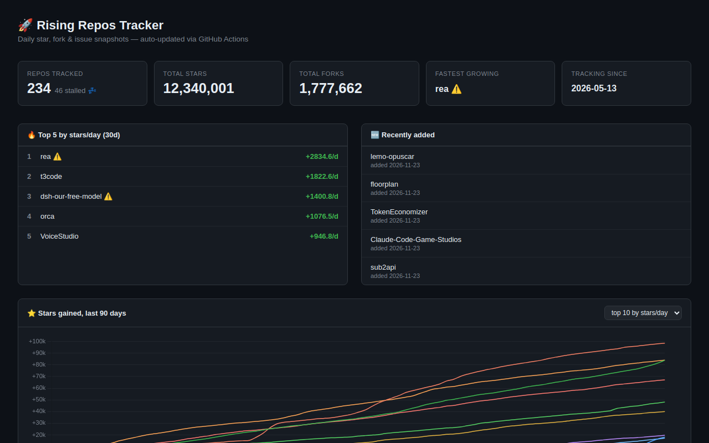
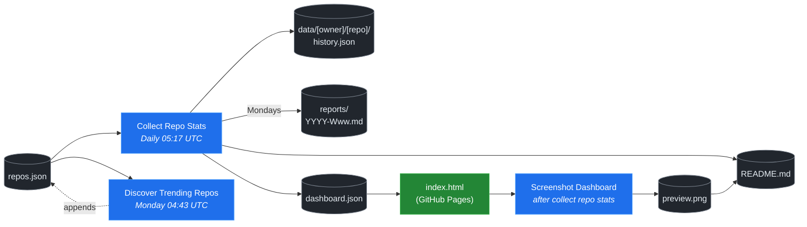

# 🚀 Rising Repos Tracker

> Automatically tracks daily GitHub stats (stars, forks, issues, velocity) for rising open source repos.

**GitHub shows a repo's star count, not how fast it is growing — this keeps a daily history so you can see which repos are actually taking off.** Runs entirely on GitHub Actions + Pages: no server, no database.

**Quick start:** 1. Fork this repo · 2. Delete my `data/` and `reports/`, put the repos you care about in [`repos.json`](./repos.json) · 3. Enable GitHub Pages and run **Collect Repo Stats** once. Details in [Fork & use it for yourself](#fork--use-it-for-yourself).

⭐ If the dashboard is useful to you, a star helps others find it.

[](https://www.telosignal.com/)


**[→ View Live Dashboard](https://patrick-creates.github.io/rising-repos-tracker/)** · **[→ Weekly reports](./reports/README.md)**

Built and maintained by [Telosignal](https://www.telosignal.com/).



<!-- AUTOGEN-STATS-START -->
## 📊 Current snapshot

> Auto-updated daily — last refreshed 2026-11-24

| Metric | Value |
|---|---|
| Repos tracked | **234** (46 stalled 💤) |
| Total stars | **12,287,413** |
| Total forks | **1,770,013** |
| Fastest growing | **rea** ⚠️ (+3094.3/day) |

### 🔥 Top 5 by velocity

> ⚠️ unusually fast growth (1,000+ stars/day over its lifetime and the last week): check before trusting. 💤 stalled repos are left out.

| # | Repo | Stars | Stars/day (30d) |
|---|---|---:|---:|
| 1 | [morluto/rea](https://github.com/morluto/rea) ⚠️ | 476,656 | +3094.3 |
| 2 | [pingdotgg/t3code](https://github.com/pingdotgg/t3code) | 76,849 | +1822.1 |
| 3 | [Ebony-Vinyl/dsh-our-free-model](https://github.com/Ebony-Vinyl/dsh-our-free-model) ⚠️ | 85,817 | +1432.1 |
| 4 | [debpalash/VoiceStudio](https://github.com/debpalash/VoiceStudio) | 117,623 | +1038.5 |
| 5 | [stablyai/orca](https://github.com/stablyai/orca) | 135,637 | +999.4 |

### 🆕 Recently added

- [lemomo-ai/lemo-opuscar](https://github.com/lemomo-ai/lemo-opuscar) — added 2026-11-23 — A toolbox of film styles made in code for Claude Code: 99 ready to use, and your own. Each style is a style prompt plus a demo film made entirely in code by Claude Opus 5.5, with no video model. By Lemomo. · 一套用代码做片的风格工具箱：99 种现成风格，也能做出你自己的
- [haydenschmitty/floorplan](https://github.com/haydenschmitty/floorplan) — added 2026-11-23 — See how your app actually fits together. An interactive, plain-English map of your codebase, drawn by Claude or Codex.
- [microsoft/TokenEconomizer](https://github.com/microsoft/TokenEconomizer) — added 2026-11-23 — Experience-Driven Black-Box Cost Control for Coding Agents
<!-- AUTOGEN-STATS-END -->

<!-- AUTOGEN-DIAGRAM-START -->
## 🔄 How it works


```mermaid
graph LR
    repos[("repos.json")]:::data
    history[("data/[owner]/[repo]/<br/>history.json")]:::data
    readme[("README.md")]:::data
    reports[("reports/<br/>YYYY-Www.md")]:::data
    preview[("preview.png")]:::data
    site[("dashboard.json")]:::data
    dashboard["index.html<br/>(GitHub Pages)"]:::output
    collect_yml["Collect Repo Stats<br/><i>Daily 05:17 UTC</i>"]:::workflow
    discover_yml["Discover Trending Repos<br/><i>Monday 04:43 UTC</i>"]:::workflow
    screenshot_yml["Screenshot Dashboard<br/><i>after collect repo stats</i>"]:::workflow
    repos --> collect_yml
    collect_yml --> history
    collect_yml --> readme
    collect_yml --> site
    collect_yml -->|Mondays| reports
    repos --> discover_yml
    discover_yml -.->|appends| repos
    dashboard --> screenshot_yml
    screenshot_yml --> preview
    site --> dashboard
    preview --> readme
    classDef workflow fill:#1f6feb,stroke:#58a6ff,color:#fff
    classDef data fill:#21262d,stroke:#7d8590,color:#e6edf3
    classDef output fill:#238636,stroke:#3fb950,color:#fff
```
<!-- AUTOGEN-DIAGRAM-END -->

<!-- AUTOGEN-WORKFLOWS-START -->
## ⚙️ Workflows

| File | Schedule | Name |
|---|---|---|
| `collect.yml` | Daily 05:17 UTC | Collect Repo Stats |
| `discover.yml` | Monday 04:43 UTC | Discover Trending Repos |
| `screenshot.yml` | After Collect Repo Stats | Screenshot Dashboard |

> All workflows commit results directly back to the repo. Schedules are best-effort — GitHub Actions cron can drift by a few minutes.
<!-- AUTOGEN-WORKFLOWS-END -->

<!-- AUTOGEN-REPOS-START -->
## 📋 All tracked repos

| Repo | Stars | Forks | Stars/day (30d) |
|---|---:|---:|---:|
| [morluto/rea](https://github.com/morluto/rea) ⚠️ | 476,656 | 116,072 | +3094.3 |
| [openclaw/openclaw](https://github.com/openclaw/openclaw) | 395,148 | 82,964 | +70.2 |
| [obra/superpowers](https://github.com/obra/superpowers) | 325,699 | 28,884 | +690.5 |
| [affaan-m/ECC](https://github.com/affaan-m/ECC) | 309,999 | 45,576 | +708.7 |
| [NousResearch/hermes-agent](https://github.com/NousResearch/hermes-agent) | 265,823 | 60,193 | +293.6 |
| [microsoft/markitdown](https://github.com/microsoft/markitdown) | 198,213 | 15,028 | +202.1 |
| [DietrichGebert/ponytail](https://github.com/DietrichGebert/ponytail) | 197,898 | 11,195 | +727.0 |
| [Significant-Gravitas/AutoGPT](https://github.com/Significant-Gravitas/AutoGPT) | 188,162 | 45,821 | +13.8 |
| [f/prompts.chat](https://github.com/f/prompts.chat) | 178,379 | 22,736 | +128.3 |
| [langgenius/dify](https://github.com/langgenius/dify) | 161,832 | 25,549 | +77.2 |
| [open-webui/open-webui](https://github.com/open-webui/open-webui) | 159,425 | 23,139 | +89.7 |
| [farion1231/cc-switch](https://github.com/farion1231/cc-switch) | 156,882 | 10,239 | +277.0 |
| [nextlevelbuilder/ui-ux-pro-max-skill](https://github.com/nextlevelbuilder/ui-ux-pro-max-skill) | 153,651 | 16,192 | +444.3 |
| [Graphify-Labs/graphify](https://github.com/Graphify-Labs/graphify) | 152,845 | 14,694 | +592.7 |
| [github/spec-kit](https://github.com/github/spec-kit) | 151,250 | 13,588 | +280.1 |
| [langchain-ai/langchain](https://github.com/langchain-ai/langchain) | 149,936 | 25,163 | +50.2 |
| [stablyai/orca](https://github.com/stablyai/orca) | 135,637 | 8,670 | +999.4 |
| [microsoft/generative-ai-for-beginners](https://github.com/microsoft/generative-ai-for-beginners) | 124,119 | 66,900 | +65.5 |
| [JuliusBrussee/caveman](https://github.com/JuliusBrussee/caveman) | 122,588 | 7,155 | +252.6 |
| [Leonxlnx/taste-skill](https://github.com/Leonxlnx/taste-skill) | 120,986 | 8,121 | +619.1 |
| [thedotmack/claude-mem](https://github.com/thedotmack/claude-mem) | 119,470 | 10,381 | +546.7 |
| [debpalash/VoiceStudio](https://github.com/debpalash/VoiceStudio) | 117,623 | 13,125 | +1038.5 |
| [paperclipai/paperclip](https://github.com/paperclipai/paperclip) | 116,617 | 19,354 | +312.2 |
| [pbakaus/impeccable](https://github.com/pbakaus/impeccable) | 116,081 | 6,918 | +729.0 |
| [Panniantong/Agent-Reach](https://github.com/Panniantong/Agent-Reach) | 114,449 | 10,273 | +400.9 |
| [nexu-io/open-design](https://github.com/nexu-io/open-design) | 109,282 | 12,355 | +178.3 |
| [ruvnet/RuView](https://github.com/ruvnet/RuView) | 105,040 | 13,620 | +183.3 |
| [tt-a1i/archify](https://github.com/tt-a1i/archify) | 99,423 | 6,806 | +343.4 |
| [vllm-project/vllm](https://github.com/vllm-project/vllm) | 97,482 | 25,232 | +67.0 |
| [OpenHands/OpenHands](https://github.com/OpenHands/OpenHands) | 94,227 | 12,614 | +80.3 |
| [koala73/worldmonitor](https://github.com/koala73/worldmonitor) | 91,137 | 14,149 | +54.4 |
| [cheaper-inference/OmniRoute](https://github.com/cheaper-inference/OmniRoute) | 90,033 | 13,984 | +298.1 |
| [heygen-com/hyperframes](https://github.com/heygen-com/hyperframes) | 89,370 | 8,331 | +577.3 |
| [ChatGPTNextWeb/NextChat](https://github.com/ChatGPTNextWeb/NextChat) 💤 | 88,989 | 58,438 | +3.2 |
| [datawhalechina/hello-agents](https://github.com/datawhalechina/hello-agents) | 87,847 | 10,970 | +110.3 |
| [rtk-ai/rtk](https://github.com/rtk-ai/rtk) | 87,687 | 5,628 | +105.1 |
| [lobehub/lobehub](https://github.com/lobehub/lobehub) | 86,094 | 16,360 | +86.9 |
| [Ebony-Vinyl/dsh-our-free-model](https://github.com/Ebony-Vinyl/dsh-our-free-model) ⚠️ | 85,817 | 2,418 | +1432.1 |
| [career-ops-hq/career-ops](https://github.com/career-ops-hq/career-ops) | 84,563 | 15,469 | +243.8 |
| [OpenMontageInc/OpenMontage](https://github.com/OpenMontageInc/OpenMontage) | 82,996 | 11,321 | +371.5 |
| [ruvnet/ruflo](https://github.com/ruvnet/ruflo) | 82,351 | 9,704 | +103.5 |
| [shareAI-lab/learn-claude-code](https://github.com/shareAI-lab/learn-claude-code) | 80,840 | 12,900 | +54.3 |
| [headroomlabs-ai/headroom](https://github.com/headroomlabs-ai/headroom) | 80,737 | 6,331 | +97.7 |
| [dair-ai/Prompt-Engineering-Guide](https://github.com/dair-ai/Prompt-Engineering-Guide) | 80,338 | 8,786 | +27.3 |
| [ComposioHQ/awesome-claude-skills](https://github.com/ComposioHQ/awesome-claude-skills) | 80,229 | 9,850 | +76.8 |
| [unslothai/unsloth](https://github.com/unslothai/unsloth) | 80,150 | 7,460 | +53.3 |
| [rohitg00/ai-engineering-from-scratch](https://github.com/rohitg00/ai-engineering-from-scratch) | 80,013 | 14,300 | +209.3 |
| [openai/openai-cookbook](https://github.com/openai/openai-cookbook) | 77,463 | 13,080 | +21.7 |
| [usestrix/strix](https://github.com/usestrix/strix) | 77,386 | 8,811 | +184.5 |
| [pingdotgg/t3code](https://github.com/pingdotgg/t3code) | 76,849 | 12,679 | +1822.1 |
| [Fission-AI/OpenSpec](https://github.com/Fission-AI/OpenSpec) | 75,621 | 5,169 | +89.0 |
| [ZhuLinsen/daily_stock_analysis](https://github.com/ZhuLinsen/daily_stock_analysis) | 74,273 | 58,406 | +240.6 |
| [mvanhorn/last30days-skill](https://github.com/mvanhorn/last30days-skill) | 73,933 | 6,520 | +283.3 |
| [ai-job-search-dev/ai-job-search](https://github.com/ai-job-search-dev/ai-job-search) | 73,230 | 23,423 | +252.8 |
| [blader/humanizer](https://github.com/blader/humanizer) | 73,035 | 5,729 | +416.3 |
| [asgeirtj/system_prompts_leaks](https://github.com/asgeirtj/system_prompts_leaks) | 72,564 | 11,693 | +79.1 |
| [code-yeongyu/oh-my-openagent](https://github.com/code-yeongyu/oh-my-openagent) | 71,099 | 5,838 | +25.7 |
| [shanraisshan/claude-code-best-practice](https://github.com/shanraisshan/claude-code-best-practice) | 69,373 | 6,885 | +43.9 |
| [xtekky/gpt4free](https://github.com/xtekky/gpt4free) 💤 | 67,101 | 13,435 | +5.7 |
| [tw93/Pake](https://github.com/tw93/Pake) | 63,993 | 13,063 | +56.1 |
| [BerriAI/litellm](https://github.com/BerriAI/litellm) | 63,816 | 13,525 | +59.7 |
| [coreyhaines31/marketingskills](https://github.com/coreyhaines31/marketingskills) | 62,383 | 9,112 | +196.2 |
| [jamiepine/voicebox](https://github.com/jamiepine/voicebox) | 61,247 | 7,732 | +90.7 |
| [MemPalace/mempalace](https://github.com/MemPalace/mempalace) | 60,682 | 7,659 | +31.5 |
| [bojieli/ai-agent-book](https://github.com/bojieli/ai-agent-book) | 59,811 | 7,026 | +132.7 |
| [router-for-me/CLIProxyAPI](https://github.com/router-for-me/CLIProxyAPI) | 59,392 | 9,122 | +106.5 |
| [ChromeDevTools/chrome-devtools-mcp](https://github.com/ChromeDevTools/chrome-devtools-mcp) | 59,162 | 4,896 | +167.9 |
| [hesreallyhim/awesome-claude-code](https://github.com/hesreallyhim/awesome-claude-code) | 58,722 | 5,010 | +73.4 |
| [Imbad0202/academic-research-skills](https://github.com/Imbad0202/academic-research-skills) | 58,396 | 4,457 | +151.5 |
| [K-Dense-AI/scientific-agent-skills](https://github.com/K-Dense-AI/scientific-agent-skills) | 58,341 | 5,111 | +125.8 |
| [alibaba/open-code-review](https://github.com/alibaba/open-code-review) | 55,977 | 4,626 | +257.2 |
| [FlowiseAI/Flowise](https://github.com/FlowiseAI/Flowise) 💤 | 55,595 | 25,100 | +2.2 |
| [ggml-org/whisper.cpp](https://github.com/ggml-org/whisper.cpp) | 55,483 | 6,347 | +27.4 |
| [elder-plinius/CL4R1T4S](https://github.com/elder-plinius/CL4R1T4S) | 53,793 | 11,234 | +76.5 |
| [obsidianmd/obsidian-skills](https://github.com/obsidianmd/obsidian-skills) | 53,614 | 3,818 | +118.4 |
| [herdrdev/herdr](https://github.com/herdrdev/herdr) | 52,607 | 4,252 | +225.8 |
| [QuantumNous/new-api](https://github.com/QuantumNous/new-api) | 52,473 | 12,832 | +60.0 |
| [HKUDS/nanobot](https://github.com/HKUDS/nanobot) | 50,297 | 8,764 | +31.8 |
| [sickn33/agentic-awesome-skills](https://github.com/sickn33/agentic-awesome-skills) | 50,244 | 7,289 | +58.2 |
| [Aider-AI/aider](https://github.com/Aider-AI/aider) | 50,239 | 5,189 | +16.4 |
| [DeusData/codebase-memory-mcp](https://github.com/DeusData/codebase-memory-mcp) | 49,118 | 4,087 | +55.1 |
| [anthropics/claude-plugins-official](https://github.com/anthropics/claude-plugins-official) | 48,099 | 5,017 | +119.1 |
| [zhayujie/CowAgent](https://github.com/zhayujie/CowAgent) | 48,059 | 10,447 | +16.0 |
| [LibreChat-AI/LibreChat](https://github.com/LibreChat-AI/LibreChat) | 47,491 | 9,794 | +39.4 |
| [AstrBotDevs/AstrBot](https://github.com/AstrBotDevs/AstrBot) | 47,437 | 3,667 | +134.0 |
| [ifixai-ai/iFixAi](https://github.com/ifixai-ai/iFixAi) | 47,106 | 1,833 | +424.6 |
| [chatanywhere/GPT_API_free](https://github.com/chatanywhere/GPT_API_free) | 46,658 | 2,784 | +60.4 |
| [Wei-Shaw/sub2api](https://github.com/Wei-Shaw/sub2api) | 46,559 | 10,142 | +49.0 |
| [langchain-ai/langgraph](https://github.com/langchain-ai/langgraph) | 45,362 | 7,846 | +49.3 |
| [p-e-w/heretic](https://github.com/p-e-w/heretic) | 42,955 | 5,368 | +215.9 |
| [wshobson/agents](https://github.com/wshobson/agents) | 42,863 | 4,536 | +38.8 |
| [tinyhumansai/openhuman](https://github.com/tinyhumansai/openhuman) | 42,837 | 4,231 | +16.7 |
| [volcengine/OpenViking](https://github.com/volcengine/OpenViking) | 42,690 | 3,553 | +63.3 |
| [chatboxai/chatbox](https://github.com/chatboxai/chatbox) | 42,521 | 4,364 | +12.6 |
| [github/awesome-copilot](https://github.com/github/awesome-copilot) | 41,516 | 5,427 | +37.3 |
| [codewhale-hq/Codewhale](https://github.com/codewhale-hq/Codewhale) 💤 | 41,197 | 3,578 | +2.6 |
| [Yeachan-Heo/oh-my-claudecode](https://github.com/Yeachan-Heo/oh-my-claudecode) | 41,050 | 3,655 | +26.3 |
| [yetone/magpie](https://github.com/yetone/magpie) | 40,951 | 3,744 | +647.6 |
| [Donchitos/Claude-Code-Game-Studios](https://github.com/Donchitos/Claude-Code-Game-Studios) | 40,804 | 5,356 | +107.0 |
| [mindsdb/mindshub](https://github.com/mindsdb/mindshub) 💤 | 39,888 | 6,230 | +2.4 |
| [can1357/oh-my-pi](https://github.com/can1357/oh-my-pi) | 39,792 | 4,599 | +107.2 |
| [JCodesMore/ai-website-cloner-template](https://github.com/JCodesMore/ai-website-cloner-template) | 39,720 | 5,906 | +78.4 |
| [google/langextract](https://github.com/google/langextract) | 39,357 | 2,757 | +10.5 |
| [AlexsJones/llmfit](https://github.com/AlexsJones/llmfit) | 39,282 | 2,544 | +30.4 |
| [virgiliojr94/book-to-skill](https://github.com/virgiliojr94/book-to-skill) | 38,934 | 4,152 | +95.7 |
| [HKUDS/Vibe-Trading](https://github.com/HKUDS/Vibe-Trading) | 38,770 | 6,324 | +69.9 |
| [PDFMathTranslate/PDFMathTranslate](https://github.com/PDFMathTranslate/PDFMathTranslate) | 38,633 | 3,461 | +25.5 |
| [agentscope-ai/QwenPaw](https://github.com/agentscope-ai/QwenPaw) | 38,173 | 3,309 | +66.6 |
| [Tencent/WeKnora](https://github.com/Tencent/WeKnora) | 38,135 | 5,343 | +91.7 |
| [songquanpeng/one-api](https://github.com/songquanpeng/one-api) 💤 | 37,476 | 6,888 | +7.7 |
| [mukul975/Anthropic-Cybersecurity-Skills](https://github.com/mukul975/Anthropic-Cybersecurity-Skills) | 36,677 | 4,488 | +55.8 |
| [esengine/DeepSeek-Reasonix](https://github.com/esengine/DeepSeek-Reasonix) 💤 | 36,073 | 2,613 | +3.8 |
| [Twigpine/openclaude](https://github.com/Twigpine/openclaude) | 34,508 | 9,116 | +11.9 |
| [iOfficeAI/AionUi](https://github.com/iOfficeAI/AionUi) | 34,477 | 3,605 | +23.9 |
| [mksglu/context-mode](https://github.com/mksglu/context-mode) | 34,445 | 2,373 | +74.0 |
| [zeroclaw-labs/zeroclaw](https://github.com/zeroclaw-labs/zeroclaw) | 33,602 | 5,050 | +18.6 |
| [iOfficeAI/OfficeCLI](https://github.com/iOfficeAI/OfficeCLI) | 33,555 | 2,300 | +36.7 |
| [tirth8205/code-review-graph](https://github.com/tirth8205/code-review-graph) | 32,926 | 2,994 | +18.2 |
| [zarazhangrui/frontend-slides](https://github.com/zarazhangrui/frontend-slides) | 32,844 | 2,506 | +32.0 |
| [decolua/9router](https://github.com/decolua/9router) | 32,813 | 6,422 | +47.0 |
| [googleworkspace/cli](https://github.com/googleworkspace/cli) | 32,459 | 2,013 | +19.5 |
| [AgriciDaniel/claude-seo](https://github.com/AgriciDaniel/claude-seo) | 32,102 | 3,929 | +381.8 |
| [langchain-ai/deepagents](https://github.com/langchain-ai/deepagents) | 31,556 | 4,465 | +32.7 |
| [hypit-ai/hypit](https://github.com/hypit-ai/hypit) | 31,348 | 3,712 | +191.6 |
| [t8y2/dbx](https://github.com/t8y2/dbx) | 31,322 | 2,847 | +119.5 |
| [jackwener/OpenCLI](https://github.com/jackwener/OpenCLI) | 31,256 | 3,063 | +20.8 |
| [ccch1mneyyy/dsh-Go](https://github.com/ccch1mneyyy/dsh-Go) | 31,249 | 1,512 | +846.8 |
| [TencentCloud/TencentDB-Agent-Memory](https://github.com/TencentCloud/TencentDB-Agent-Memory) | 31,140 | 3,056 | +40.8 |
| [rohitg00/agentmemory](https://github.com/rohitg00/agentmemory) | 30,562 | 2,719 | +22.6 |
| [alibaba/page-agent](https://github.com/alibaba/page-agent) 💤 | 29,748 | 2,657 | +6.2 |
| [jarrodwatts/claude-hud](https://github.com/jarrodwatts/claude-hud) | 29,296 | 1,349 | +14.2 |
| [manaflow-ai/cmux](https://github.com/manaflow-ai/cmux) | 28,945 | 2,700 | +16.3 |
| [BloopAI/vibe-kanban](https://github.com/BloopAI/vibe-kanban) | 28,802 | 3,071 | +11.6 |
| [every-app/open-seo](https://github.com/every-app/open-seo) | 28,788 | 4,083 | +128.3 |
| [voideditor/void](https://github.com/voideditor/void) 💤 | 28,699 | 2,657 | — |
| [guillaumemeyer/watermarks-remover](https://github.com/guillaumemeyer/watermarks-remover) | 28,329 | 3,183 | +115.2 |
| [OthmanAdi/planning-with-files](https://github.com/OthmanAdi/planning-with-files) | 28,219 | 2,331 | +13.0 |
| [NVIDIA/SkillSpector](https://github.com/NVIDIA/SkillSpector) | 27,508 | 2,455 | +197.4 |
| [zai-org/Open-AutoGLM](https://github.com/zai-org/Open-AutoGLM) 💤 | 26,659 | 4,064 | +5.9 |
| [vercel-labs/agent-desktop](https://github.com/vercel-labs/agent-desktop) | 26,471 | 1,988 | +425.2 |
| [walkinglabs/learn-harness-engineering](https://github.com/walkinglabs/learn-harness-engineering) | 26,010 | 2,997 | +152.6 |
| [pascalorg/editor](https://github.com/pascalorg/editor) | 25,716 | 3,205 | +20.5 |
| [toon-format/toon](https://github.com/toon-format/toon) 💤 | 25,659 | 1,125 | +3.4 |
| [jundot/omlx](https://github.com/jundot/omlx) | 23,904 | 2,205 | +28.7 |
| [DuarteSantos8/openGym](https://github.com/DuarteSantos8/openGym) | 23,837 | 3,199 | +221.4 |
| [pranshuparmar/witr](https://github.com/pranshuparmar/witr) | 23,419 | 831 | +21.0 |
| [steipete/CodexBar](https://github.com/steipete/CodexBar) | 23,316 | 2,249 | +17.3 |
| [KKKKhazix/khazix-skills](https://github.com/KKKKhazix/khazix-skills) | 22,515 | 2,363 | +28.7 |
| [winfunc/opcode](https://github.com/winfunc/opcode) 💤 | 22,463 | 1,704 | +1.5 |
| [jnMetaCode/agency-agents-zh](https://github.com/jnMetaCode/agency-agents-zh) | 22,299 | 3,567 | +23.8 |
| [1jehuang/jcode](https://github.com/1jehuang/jcode) | 22,016 | 2,581 | +27.2 |
| [NirDiamant/agents-towards-production](https://github.com/NirDiamant/agents-towards-production) 💤 | 21,948 | 2,898 | +5.9 |
| [coze-dev/coze-studio](https://github.com/coze-dev/coze-studio) 💤 | 21,824 | 3,140 | +2.2 |
| [xerj-org/xerj](https://github.com/xerj-org/xerj) | 21,310 | 1,328 | +193.1 |
| [dataelement/dsh-desktop](https://github.com/dataelement/dsh-desktop) | 21,165 | 715 | +142.2 |
| [lemomo-ai/lemo-opuscar](https://github.com/lemomo-ai/lemo-opuscar) | 20,572 | 2,645 | +387.0 |
| [datawhalechina/easy-vibe](https://github.com/datawhalechina/easy-vibe) | 20,509 | 1,979 | +11.4 |
| [jlcodes99/cockpit-tools](https://github.com/jlcodes99/cockpit-tools) | 20,401 | 1,851 | +35.5 |
| [rocketride-org/rocketride-server](https://github.com/rocketride-org/rocketride-server) | 19,989 | 8,664 | +76.2 |
| [danielmiessler/LifeOS](https://github.com/danielmiessler/LifeOS) | 19,986 | 2,540 | +13.6 |
| [tanweai/pua](https://github.com/tanweai/pua) 💤 | 19,882 | 1,208 | +4.5 |
| [wanshuiyin/Auto-claude-code-research-in-sleep](https://github.com/wanshuiyin/Auto-claude-code-research-in-sleep) | 19,756 | 1,581 | +56.6 |
| [nesquena/hermes-webui](https://github.com/nesquena/hermes-webui) | 19,625 | 2,861 | +14.8 |
| [browser-use/browser-harness](https://github.com/browser-use/browser-harness) | 19,226 | 1,900 | +20.5 |
| [microsoft/agent-lightning](https://github.com/microsoft/agent-lightning) 💤 | 18,995 | 1,727 | +6.2 |
| [lidge-jun/opencodex](https://github.com/lidge-jun/opencodex) | 18,734 | 1,541 | +10.0 |
| [RightNow-AI/openfang](https://github.com/RightNow-AI/openfang) 💤 | 18,276 | 2,287 | +1.7 |
| [opensandbox-group/OpenSandbox](https://github.com/opensandbox-group/OpenSandbox) | 17,876 | 1,725 | +47.0 |
| [tradecatlabs/vibe-coding-cn](https://github.com/tradecatlabs/vibe-coding-cn) | 17,751 | 1,791 | +36.1 |
| [MemoriLabs/Memori](https://github.com/MemoriLabs/Memori) | 17,599 | 4,001 | +15.2 |
| [Evolink-AI/awesome-gpt-image-2-API-Prompts](https://github.com/Evolink-AI/awesome-gpt-image-2-API-Prompts) | 17,430 | 1,758 | — |
| [composio-community/awesome-codex-skills](https://github.com/composio-community/awesome-codex-skills) | 17,418 | 1,794 | +12.2 |
| [xpzouying/xiaohongshu-mcp](https://github.com/xpzouying/xiaohongshu-mcp) | 17,311 | 2,553 | +25.1 |
| [xbtlin/ai-berkshire](https://github.com/xbtlin/ai-berkshire) | 17,242 | 2,544 | +12.1 |
| [cft0808/edict](https://github.com/cft0808/edict) 💤 | 17,122 | 1,775 | +3.6 |
| [ParadevAI/Paradev](https://github.com/ParadevAI/Paradev) | 16,543 | 1,491 | +33.2 |
| [Anionex/banana-slides](https://github.com/Anionex/banana-slides) 💤 | 16,078 | 1,799 | +6.9 |
| [miuuyy/codex-chatgpt-web](https://github.com/miuuyy/codex-chatgpt-web) | 15,887 | 1,240 | +19.0 |
| [ConardLi/garden-skills](https://github.com/ConardLi/garden-skills) | 15,741 | 1,780 | +82.2 |
| [NanmiCoder/cc-haha](https://github.com/NanmiCoder/cc-haha) | 15,543 | 8,613 | +12.7 |
| [yusufkaraaslan/Skill_Seekers](https://github.com/yusufkaraaslan/Skill_Seekers) 💤 | 15,364 | 1,569 | +4.8 |
| [Tracer-Cloud/opensre](https://github.com/Tracer-Cloud/opensre) | 15,071 | 2,004 | +109.7 |
| [kyegomez/OpenMythos](https://github.com/kyegomez/OpenMythos) 💤 | 14,930 | 3,260 | +0.7 |
| [NevaMind-AI/memU](https://github.com/NevaMind-AI/memU) 💤 | 14,636 | 1,104 | +2.5 |
| [openai/codex-security](https://github.com/openai/codex-security) | 14,325 | 1,135 | +104.1 |
| [EverMind-AI/EverOS](https://github.com/EverMind-AI/EverOS) | 13,993 | 983 | +13.1 |
| [OpenByteInc/QuantDinger](https://github.com/OpenByteInc/QuantDinger) | 13,964 | 2,832 | +28.1 |
| [0x4m4/hexstrike-ai](https://github.com/0x4m4/hexstrike-ai) | 13,862 | 2,853 | +25.7 |
| [XiaomiMiMo/MiMo-Code](https://github.com/XiaomiMiMo/MiMo-Code) 💤 | 13,794 | 1,478 | +2.4 |
| [sirmalloc/ccstatusline](https://github.com/sirmalloc/ccstatusline) 💤 | 13,686 | 614 | +9.4 |
| [genspark-ai/genoffice](https://github.com/genspark-ai/genoffice) | 12,870 | 1,793 | +68.4 |
| [MemTensor/MemOS](https://github.com/MemTensor/MemOS) | 12,501 | 1,132 | +13.6 |
| [TencentCloud/Octop](https://github.com/TencentCloud/Octop) | 12,448 | 1,778 | +47.9 |
| [Nasiko-Labs/nasiko](https://github.com/Nasiko-Labs/nasiko) | 11,936 | 3,222 | +82.7 |
| [getagentseal/codeburn](https://github.com/getagentseal/codeburn) | 11,902 | 911 | +10.9 |
| [EKKOLearnAI/ekko-studio](https://github.com/EKKOLearnAI/ekko-studio) 💤 | 11,812 | 1,477 | +8.9 |
| [trailhq/Trail-Code](https://github.com/trailhq/Trail-Code) | 11,467 | 1,033 | +23.9 |
| [holaboss-ai/holaOS](https://github.com/holaboss-ai/holaOS) 💤 | 11,356 | 724 | — |
| [aden-hive/hive](https://github.com/aden-hive/hive) 💤 | 11,168 | 5,633 | +1.5 |
| [ValueCell-ai/valuecell](https://github.com/ValueCell-ai/valuecell) 💤 | 11,068 | 1,807 | +1.3 |
| [StarTrail-org/PixelRAG](https://github.com/StarTrail-org/PixelRAG) | 10,978 | 985 | +21.0 |
| [MakazhanAlpamys/Soup](https://github.com/MakazhanAlpamys/Soup) | 10,766 | 1,792 | +37.4 |
| [Tencent/BrowserSkill](https://github.com/Tencent/BrowserSkill) | 10,701 | 786 | +38.5 |
| [makecindy/cindy](https://github.com/makecindy/cindy) | 10,544 | 1,347 | +70.7 |
| [Jakeschincariol/replica-skill](https://github.com/Jakeschincariol/replica-skill) | 10,516 | 1,933 | +128.9 |
| [ykdojo/claude-code-tips](https://github.com/ykdojo/claude-code-tips) 💤 | 10,376 | 828 | +3.6 |
| [Kuberwastaken/claurst](https://github.com/Kuberwastaken/claurst) 💤 | 10,346 | 7,636 | +0.6 |
| [YouMind-OpenLab/awesome-gpt-image-2](https://github.com/YouMind-OpenLab/awesome-gpt-image-2) | 10,332 | 903 | +4.0 |
| [Companion-Inc/feynman](https://github.com/Companion-Inc/feynman) 💤 | 10,154 | 1,115 | +4.4 |
| [open-slide/open-slide](https://github.com/open-slide/open-slide) | 9,904 | 725 | +16.5 |
| [modem-dev/hunk](https://github.com/modem-dev/hunk) 💤 | 9,884 | 340 | +6.7 |
| [frankbria/ralph-claude-code](https://github.com/frankbria/ralph-claude-code) 💤 | 9,739 | 727 | +0.8 |
| [iflytek/astron-agent](https://github.com/iflytek/astron-agent) 💤 | 8,924 | 913 | — |
| [WenyuChiou/awesome-agentic-ai-zh](https://github.com/WenyuChiou/awesome-agentic-ai-zh) | 8,864 | 1,095 | +29.0 |
| [EvoMap/evolver](https://github.com/EvoMap/evolver) 💤 | 8,748 | 850 | +1.5 |
| [rorkai/App-Store-Connect-CLI](https://github.com/rorkai/App-Store-Connect-CLI) | 8,512 | 743 | +15.9 |
| [MiroMindAI/MiroThinker](https://github.com/MiroMindAI/MiroThinker) 💤 | 8,454 | 648 | +0.9 |
| [JetBrains/thinkrail](https://github.com/JetBrains/thinkrail) | 8,428 | 538 | +26.2 |
| [OpenCoworkAI/open-codesign](https://github.com/OpenCoworkAI/open-codesign) | 8,251 | 879 | +1.0 |
| [mmulet/term.everything](https://github.com/mmulet/term.everything) 💤 | 8,126 | 198 | +0.3 |
| [microsoft/TokenEconomizer](https://github.com/microsoft/TokenEconomizer) | 8,069 | 573 | +64.0 |
| [ValueCell-ai/ClawX](https://github.com/ValueCell-ai/ClawX) 💤 | 7,587 | 1,137 | — |
| [ZSeven-W/openpencil](https://github.com/ZSeven-W/openpencil) | 7,354 | 637 | +22.8 |
| [tech-leads-club/agent-skills](https://github.com/tech-leads-club/agent-skills) 💤 | 7,203 | 569 | +3.8 |
| [TokenRhythm/opensquilla](https://github.com/TokenRhythm/opensquilla) 💤 | 7,163 | 597 | +2.7 |
| [steipete/summarize](https://github.com/steipete/summarize) 💤 | 6,876 | 462 | +4.3 |
| [Andyyyy64/whichllm](https://github.com/Andyyyy64/whichllm) 💤 | 6,856 | 379 | +2.3 |
| [Arthur-Ficial/apfel](https://github.com/Arthur-Ficial/apfel) 💤 | 6,624 | 253 | +3.3 |
| [haydenschmitty/floorplan](https://github.com/haydenschmitty/floorplan) | 6,604 | 597 | +212.0 |
| [EverMind-AI/Raven](https://github.com/EverMind-AI/Raven) | 6,314 | 276 | +10.0 |
| [microsoft/fara](https://github.com/microsoft/fara) 💤 | 6,261 | 610 | +1.3 |
| [UfoMiao/zcf](https://github.com/UfoMiao/zcf) 💤 | 6,065 | 419 | — |
| [sandbox-quantum/switch](https://github.com/sandbox-quantum/switch) | 4,740 | 371 | +43.0 |
| [re4/LibreCode](https://github.com/re4/LibreCode) 💤 | 86 | 4 | — |
<!-- AUTOGEN-REPOS-END -->

---

## What it does

- Collects daily snapshots of stars, forks, watchers and open issues for every tracked repo
- Discovers new trending repos automatically every Monday using the GitHub Search API
- Shows each repo's GitHub description and topics in the dashboard, refreshed with every daily snapshot
- Writes a weekly report every Monday to [`reports/`](./reports/README.md): top 10 by stars gained, top 10 by growth rate, newly tracked repos; unusual jumps (over 50% in a week or 25% in a day) are marked ⚠️
- Stores all history as plain JSON — no database, no backend
- Renders a live dashboard via GitHub Pages — updates daily, zero maintenance

Star counts come from the GitHub API as they are. A viral launch, bulk starring or a repo rename can all show up as a jump; check the repo before quoting a number.

## Tracked repos

Data lives in [`data/`](./data) — one folder per repo, one `history.json` per entry.  
The full watch list is in [`repos.json`](./repos.json).

## Fork & use it for yourself

This is my personal tracker — the watch list reflects what I find interesting. If you want to track different repos, the best path is to **fork this repo and run your own**.

### Setup

1. Fork this repo to your account
2. Clear my data and set your own watch list. The fork brings my full history (one folder per repo in `data/`, plus `reports/`), which would mix into your charts:
   ```bash
   git rm -r -q data reports
   ```
   Then replace the contents of [`repos.json`](./repos.json) with the repos you want to track (or leave one entry — `discover.yml` auto-adds more every Monday) and commit.
3. Go to **Settings → Pages** and enable GitHub Pages from the `main` branch
4. Go to **Actions**, enable workflows (GitHub disables them on forks by default) and run **Collect Repo Stats** once manually to seed your first data point
5. Your dashboard will be live at `https://YOUR-USERNAME.github.io/rising-repos-tracker/`

That's it — daily collection, weekly discovery and the Monday report run automatically on schedule. Zero ongoing maintenance.

### Repo descriptions

Clicking a repo in the dashboard shows its GitHub description and topics, taken from the daily snapshot. Until 2026 the tracker also generated AI summaries with GitHub Models; GitHub retired that service on 2026-07-30. The summaries generated before then stay in `data/<owner>/<repo>/summary.json` and are shown below the description, dated; no new ones are generated.

### Customizing what gets discovered

Edit [`scripts/discover.js`](./scripts/discover.js) to change:

- `MIN_STARS` — minimum star threshold for candidates
- `MAX_AGE_DAYS` — how recent a repo must be
- `MAX_NEW_REPOS` — how many to add per discovery run
- The `queries` array — GitHub Search API queries that define what "trending" means to you

### Adding a repo manually

Just edit `repos.json` directly:

```json
{
  "owner": "OWNER",
  "repo": "REPO",
  "added": "YYYY-MM-DD",
  "notes": "why you're tracking this",
  "created_at": "YYYY-MM-DD"
}
```

`created_at` (the repo's creation date) is optional; without it the repo only shows under "all ages" in the dashboard's age filter. The next daily collect run picks it up automatically.

## Stack

- **GitHub Actions** — scheduling and automation
- **GitHub Pages** — dashboard hosting
- **GitHub API** — data source
- **Chart.js** — star growth visualization
- **Mermaid** — architecture diagram (rendered by GitHub)
- Collecting, reports and README use Node built-ins only; the screenshot workflow installs Puppeteer. No build step, no database

## License

MIT
