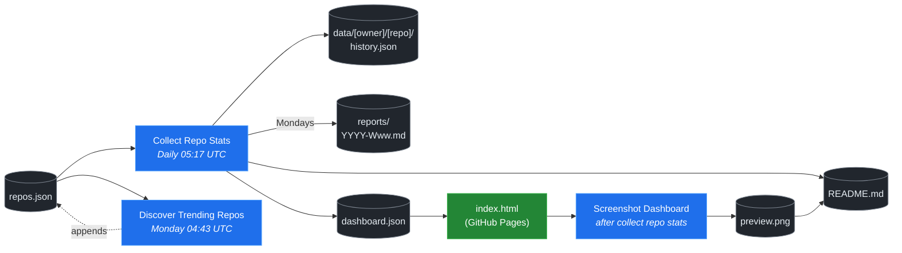

# 🚀 Rising Repos Tracker

> Automatically tracks daily GitHub stats (stars, forks, issues, velocity) for rising open source repos.

**GitHub shows a repo's star count, not how fast it is growing — this keeps a daily history so you can see which repos are actually taking off.** Runs entirely on GitHub Actions + Pages: no server, no database.

**Quick start:** 1. Fork this repo · 2. Delete my `data/` and `reports/`, put the repos you care about in [`repos.json`](./repos.json) · 3. Enable GitHub Pages and run **Collect Repo Stats** once. Details in [Fork & use it for yourself](#fork--use-it-for-yourself).

⭐ If the dashboard is useful to you, a star helps others find it.

[](https://www.telosignal.com/)


**[→ View Live Dashboard](https://patrick-creates.github.io/rising-repos-tracker/)** · **[→ Weekly reports](./reports/README.md)**

Built and maintained by [Telosignal](https://www.telosignal.com/).


<!-- AUTOGEN-STATS-START -->
## 📊 Current snapshot

> Auto-updated daily — last refreshed 2026-11-27

| Metric | Value |
|---|---|
| Repos tracked | **234** (46 stalled 💤) |
| Total stars | **12,366,912** |
| Total forks | **1,781,051** |
| Fastest growing | **rea** ⚠️ (+2695.9/day) |

### 🔥 Top 5 by velocity

> ⚠️ unusually fast growth (1,000+ stars/day over its lifetime and the last week): check before trusting. 💤 stalled repos are left out.

| # | Repo | Stars | Stars/day (30d) |
|---|---|---:|---:|
| 1 | [morluto/rea](https://github.com/morluto/rea) ⚠️ | 480,688 | +2695.9 |
| 2 | [pingdotgg/t3code](https://github.com/pingdotgg/t3code) | 81,811 | +1776.3 |
| 3 | [Ebony-Vinyl/dsh-our-free-model](https://github.com/Ebony-Vinyl/dsh-our-free-model) ⚠️ | 88,940 | +1364.0 |
| 4 | [stablyai/orca](https://github.com/stablyai/orca) | 141,973 | +1113.9 |
| 5 | [debpalash/VoiceStudio](https://github.com/debpalash/VoiceStudio) | 119,214 | +900.5 |

### 🆕 Recently added

- [lemomo-ai/lemo-opuscar](https://github.com/lemomo-ai/lemo-opuscar) — added 2026-11-23 — A toolbox of film styles made in code for Claude Code: 99 ready to use, and your own. Each style is a style prompt plus a demo film made entirely in code by Claude Opus 5.5, with no video model. By Lemomo. · 一套用代码做片的风格工具箱：99 种现成风格，也能做出你自己的
- [haydenschmitty/floorplan](https://github.com/haydenschmitty/floorplan) — added 2026-11-23 — See how your app actually fits together. An interactive, plain-English map of your codebase, drawn by Claude or Codex.
- [microsoft/TokenEconomizer](https://github.com/microsoft/TokenEconomizer) — added 2026-11-23 — Experience-Driven Black-Box Cost Control for Coding Agents
<!-- AUTOGEN-STATS-END -->

<!-- AUTOGEN-DIAGRAM-START -->
## 🔄 How it works


```mermaid
graph LR
    repos[("repos.json")]:::data
    history[("data/[owner]/[repo]/<br/>history.json")]:::data
    readme[("README.md")]:::data
    reports[("reports/<br/>YYYY-Www.md")]:::data
    preview[("preview.png")]:::data
    site[("dashboard.json")]:::data
    dashboard["index.html<br/>(GitHub Pages)"]:::output
    collect_yml["Collect Repo Stats<br/><i>Daily 05:17 UTC</i>"]:::workflow
    discover_yml["Discover Trending Repos<br/><i>Monday 04:43 UTC</i>"]:::workflow
    screenshot_yml["Screenshot Dashboard<br/><i>after collect repo stats</i>"]:::workflow
    repos --> collect_yml
    collect_yml --> history
    collect_yml --> readme
    collect_yml --> site
    collect_yml -->|Mondays| reports
    repos --> discover_yml
    discover_yml -.->|appends| repos
    dashboard --> screenshot_yml
    screenshot_yml --> preview
    site --> dashboard
    preview --> readme
    classDef workflow fill:#1f6feb,stroke:#58a6ff,color:#fff
    classDef data fill:#21262d,stroke:#7d8590,color:#e6edf3
    classDef output fill:#238636,stroke:#3fb950,color:#fff
```
<!-- AUTOGEN-DIAGRAM-END -->

<!-- AUTOGEN-WORKFLOWS-START -->
## ⚙️ Workflows

| File | Schedule | Name |
|---|---|---|
| `collect.yml` | Daily 05:17 UTC | Collect Repo Stats |
| `discover.yml` | Monday 04:43 UTC | Discover Trending Repos |
| `screenshot.yml` | After Collect Repo Stats | Screenshot Dashboard |

> All workflows commit results directly back to the repo. Schedules are best-effort — GitHub Actions cron can drift by a few minutes.
<!-- AUTOGEN-WORKFLOWS-END -->

<!-- AUTOGEN-REPOS-START -->
## 📋 All tracked repos

| Repo | Stars | Forks | Stars/day (30d) |
|---|---:|---:|---:|
| [morluto/rea](https://github.com/morluto/rea) ⚠️ | 480,688 | 116,764 | +2695.9 |
| [openclaw/openclaw](https://github.com/openclaw/openclaw) | 395,334 | 83,016 | +69.6 |
| [obra/superpowers](https://github.com/obra/superpowers) | 328,038 | 29,134 | +704.7 |
| [affaan-m/ECC](https://github.com/affaan-m/ECC) | 311,625 | 45,770 | +677.4 |
| [NousResearch/hermes-agent](https://github.com/NousResearch/hermes-agent) | 266,563 | 60,490 | +288.3 |
| [DietrichGebert/ponytail](https://github.com/DietrichGebert/ponytail) | 199,788 | 11,354 | +705.9 |
| [microsoft/markitdown](https://github.com/microsoft/markitdown) | 198,716 | 15,095 | +202.3 |
| [Significant-Gravitas/AutoGPT](https://github.com/Significant-Gravitas/AutoGPT) | 188,208 | 45,834 | +13.7 |
| [f/prompts.chat](https://github.com/f/prompts.chat) | 178,673 | 22,766 | +125.6 |
| [langgenius/dify](https://github.com/langgenius/dify) | 162,018 | 25,567 | +73.9 |
| [open-webui/open-webui](https://github.com/open-webui/open-webui) | 159,679 | 23,166 | +88.5 |
| [farion1231/cc-switch](https://github.com/farion1231/cc-switch) | 157,631 | 10,300 | +266.6 |
| [nextlevelbuilder/ui-ux-pro-max-skill](https://github.com/nextlevelbuilder/ui-ux-pro-max-skill) | 154,954 | 16,320 | +437.7 |
| [Graphify-Labs/graphify](https://github.com/Graphify-Labs/graphify) | 154,128 | 14,838 | +559.9 |
| [github/spec-kit](https://github.com/github/spec-kit) | 152,052 | 13,666 | +286.0 |
| [langchain-ai/langchain](https://github.com/langchain-ai/langchain) | 150,082 | 25,183 | +49.1 |
| [stablyai/orca](https://github.com/stablyai/orca) | 141,973 | 9,092 | +1113.9 |
| [microsoft/generative-ai-for-beginners](https://github.com/microsoft/generative-ai-for-beginners) | 124,429 | 67,127 | +70.4 |
| [JuliusBrussee/caveman](https://github.com/JuliusBrussee/caveman) | 123,238 | 7,212 | +252.7 |
| [Leonxlnx/taste-skill](https://github.com/Leonxlnx/taste-skill) | 122,212 | 8,237 | +607.7 |
| [thedotmack/claude-mem](https://github.com/thedotmack/claude-mem) | 120,133 | 10,455 | +542.3 |
| [debpalash/VoiceStudio](https://github.com/debpalash/VoiceStudio) | 119,214 | 13,309 | +900.5 |
| [pbakaus/impeccable](https://github.com/pbakaus/impeccable) | 117,870 | 7,066 | +713.0 |
| [paperclipai/paperclip](https://github.com/paperclipai/paperclip) | 117,523 | 19,562 | +312.3 |
| [Panniantong/Agent-Reach](https://github.com/Panniantong/Agent-Reach) | 115,260 | 10,370 | +333.3 |
| [nexu-io/open-design](https://github.com/nexu-io/open-design) | 109,780 | 12,385 | +175.3 |
| [ruvnet/RuView](https://github.com/ruvnet/RuView) | 105,339 | 13,675 | +161.0 |
| [tt-a1i/archify](https://github.com/tt-a1i/archify) | 100,831 | 6,910 | +335.5 |
| [vllm-project/vllm](https://github.com/vllm-project/vllm) | 97,698 | 25,373 | +64.7 |
| [OpenHands/OpenHands](https://github.com/OpenHands/OpenHands) | 94,452 | 12,663 | +79.2 |
| [heygen-com/hyperframes](https://github.com/heygen-com/hyperframes) | 91,291 | 8,523 | +565.2 |
| [koala73/worldmonitor](https://github.com/koala73/worldmonitor) | 91,249 | 14,175 | +51.6 |
| [cheaper-inference/OmniRoute](https://github.com/cheaper-inference/OmniRoute) | 90,693 | 14,133 | +288.8 |
| [ChatGPTNextWeb/NextChat](https://github.com/ChatGPTNextWeb/NextChat) 💤 | 88,983 | 58,410 | +2.5 |
| [Ebony-Vinyl/dsh-our-free-model](https://github.com/Ebony-Vinyl/dsh-our-free-model) ⚠️ | 88,940 | 2,517 | +1364.0 |
| [datawhalechina/hello-agents](https://github.com/datawhalechina/hello-agents) | 88,096 | 11,002 | +100.2 |
| [rtk-ai/rtk](https://github.com/rtk-ai/rtk) | 88,024 | 5,661 | +106.2 |
| [lobehub/lobehub](https://github.com/lobehub/lobehub) | 86,202 | 16,366 | +88.4 |
| [career-ops-hq/career-ops](https://github.com/career-ops-hq/career-ops) | 85,166 | 15,585 | +236.0 |
| [OpenMontageInc/OpenMontage](https://github.com/OpenMontageInc/OpenMontage) | 83,803 | 11,432 | +373.8 |
| [ruvnet/ruflo](https://github.com/ruvnet/ruflo) | 82,542 | 9,717 | +89.1 |
| [pingdotgg/t3code](https://github.com/pingdotgg/t3code) | 81,811 | 14,416 | +1776.3 |
| [shareAI-lab/learn-claude-code](https://github.com/shareAI-lab/learn-claude-code) | 80,990 | 12,912 | +52.7 |
| [headroomlabs-ai/headroom](https://github.com/headroomlabs-ai/headroom) | 80,985 | 6,361 | +96.5 |
| [rohitg00/ai-engineering-from-scratch](https://github.com/rohitg00/ai-engineering-from-scratch) | 80,802 | 14,488 | +197.0 |
| [ComposioHQ/awesome-claude-skills](https://github.com/ComposioHQ/awesome-claude-skills) | 80,444 | 9,921 | +76.6 |
| [dair-ai/Prompt-Engineering-Guide](https://github.com/dair-ai/Prompt-Engineering-Guide) | 80,412 | 8,796 | +26.7 |
| [unslothai/unsloth](https://github.com/unslothai/unsloth) | 80,350 | 7,488 | +56.1 |
| [usestrix/strix](https://github.com/usestrix/strix) | 77,930 | 8,913 | +182.7 |
| [openai/openai-cookbook](https://github.com/openai/openai-cookbook) | 77,537 | 13,088 | +23.1 |
| [mvanhorn/last30days-skill](https://github.com/mvanhorn/last30days-skill) | 76,176 | 6,755 | +347.6 |
| [Fission-AI/OpenSpec](https://github.com/Fission-AI/OpenSpec) | 75,875 | 5,204 | +88.2 |
| [ZhuLinsen/daily_stock_analysis](https://github.com/ZhuLinsen/daily_stock_analysis) | 74,981 | 58,853 | +259.3 |
| [blader/humanizer](https://github.com/blader/humanizer) | 74,227 | 5,844 | +416.7 |
| [ai-job-search-dev/ai-job-search](https://github.com/ai-job-search-dev/ai-job-search) | 73,692 | 23,550 | +224.0 |
| [asgeirtj/system_prompts_leaks](https://github.com/asgeirtj/system_prompts_leaks) | 72,789 | 11,733 | +81.4 |
| [code-yeongyu/oh-my-openagent](https://github.com/code-yeongyu/oh-my-openagent) | 71,157 | 5,839 | +24.3 |
| [shanraisshan/claude-code-best-practice](https://github.com/shanraisshan/claude-code-best-practice) | 69,456 | 6,892 | +40.8 |
| [xtekky/gpt4free](https://github.com/xtekky/gpt4free) 💤 | 67,117 | 13,425 | +5.4 |
| [tw93/Pake](https://github.com/tw93/Pake) | 64,088 | 13,076 | +58.3 |
| [BerriAI/litellm](https://github.com/BerriAI/litellm) | 64,022 | 13,618 | +59.9 |
| [coreyhaines31/marketingskills](https://github.com/coreyhaines31/marketingskills) | 62,973 | 9,196 | +199.0 |
| [jamiepine/voicebox](https://github.com/jamiepine/voicebox) | 61,388 | 7,751 | +85.0 |
| [MemPalace/mempalace](https://github.com/MemPalace/mempalace) | 60,736 | 7,666 | +32.3 |
| [bojieli/ai-agent-book](https://github.com/bojieli/ai-agent-book) | 60,101 | 7,064 | +125.0 |
| [router-for-me/CLIProxyAPI](https://github.com/router-for-me/CLIProxyAPI) | 59,595 | 9,146 | +95.2 |
| [ChromeDevTools/chrome-devtools-mcp](https://github.com/ChromeDevTools/chrome-devtools-mcp) | 59,583 | 4,902 | +174.9 |
| [hesreallyhim/awesome-claude-code](https://github.com/hesreallyhim/awesome-claude-code) | 58,920 | 5,021 | +73.4 |
| [Imbad0202/academic-research-skills](https://github.com/Imbad0202/academic-research-skills) | 58,809 | 4,482 | +151.2 |
| [K-Dense-AI/scientific-agent-skills](https://github.com/K-Dense-AI/scientific-agent-skills) | 58,670 | 5,130 | +121.0 |
| [alibaba/open-code-review](https://github.com/alibaba/open-code-review) | 56,829 | 4,698 | +269.0 |
| [FlowiseAI/Flowise](https://github.com/FlowiseAI/Flowise) 💤 | 55,602 | 25,100 | +2.4 |
| [ggml-org/whisper.cpp](https://github.com/ggml-org/whisper.cpp) | 55,585 | 6,361 | +28.6 |
| [obsidianmd/obsidian-skills](https://github.com/obsidianmd/obsidian-skills) | 54,236 | 3,859 | +131.6 |
| [elder-plinius/CL4R1T4S](https://github.com/elder-plinius/CL4R1T4S) | 53,867 | 11,245 | +77.0 |
| [herdrdev/herdr](https://github.com/herdrdev/herdr) | 53,204 | 4,297 | +231.0 |
| [QuantumNous/new-api](https://github.com/QuantumNous/new-api) | 52,647 | 12,887 | +59.3 |
| [sickn33/agentic-awesome-skills](https://github.com/sickn33/agentic-awesome-skills) | 50,440 | 7,312 | +59.8 |
| [HKUDS/nanobot](https://github.com/HKUDS/nanobot) | 50,395 | 8,780 | +28.3 |
| [Aider-AI/aider](https://github.com/Aider-AI/aider) | 50,284 | 5,195 | +16.5 |
| [DeusData/codebase-memory-mcp](https://github.com/DeusData/codebase-memory-mcp) | 49,246 | 4,101 | +51.7 |
| [anthropics/claude-plugins-official](https://github.com/anthropics/claude-plugins-official) | 48,434 | 5,076 | +113.5 |
| [zhayujie/CowAgent](https://github.com/zhayujie/CowAgent) | 48,112 | 10,453 | +15.5 |
| [AstrBotDevs/AstrBot](https://github.com/AstrBotDevs/AstrBot) | 47,634 | 3,689 | +108.8 |
| [LibreChat-AI/LibreChat](https://github.com/LibreChat-AI/LibreChat) | 47,582 | 9,822 | +39.0 |
| [ifixai-ai/iFixAi](https://github.com/ifixai-ai/iFixAi) | 47,577 | 1,842 | +372.8 |
| [chatanywhere/GPT_API_free](https://github.com/chatanywhere/GPT_API_free) | 46,831 | 2,783 | +61.7 |
| [Wei-Shaw/sub2api](https://github.com/Wei-Shaw/sub2api) | 46,714 | 10,174 | +51.0 |
| [langchain-ai/langgraph](https://github.com/langchain-ai/langgraph) | 45,506 | 7,877 | +48.9 |
| [p-e-w/heretic](https://github.com/p-e-w/heretic) | 43,423 | 5,471 | +217.8 |
| [wshobson/agents](https://github.com/wshobson/agents) | 42,979 | 4,554 | +35.8 |
| [volcengine/OpenViking](https://github.com/volcengine/OpenViking) | 42,926 | 3,583 | +63.5 |
| [tinyhumansai/openhuman](https://github.com/tinyhumansai/openhuman) | 42,883 | 4,233 | +16.7 |
| [chatboxai/chatbox](https://github.com/chatboxai/chatbox) | 42,554 | 4,369 | +13.0 |
| [yetone/magpie](https://github.com/yetone/magpie) | 42,433 | 3,897 | +603.5 |
| [github/awesome-copilot](https://github.com/github/awesome-copilot) | 41,623 | 5,444 | +37.8 |
| [codewhale-hq/Codewhale](https://github.com/codewhale-hq/Codewhale) 💤 | 41,215 | 3,579 | +2.7 |
| [Donchitos/Claude-Code-Game-Studios](https://github.com/Donchitos/Claude-Code-Game-Studios) | 41,156 | 5,401 | +114.8 |
| [Yeachan-Heo/oh-my-claudecode](https://github.com/Yeachan-Heo/oh-my-claudecode) | 41,097 | 3,664 | +25.3 |
| [can1357/oh-my-pi](https://github.com/can1357/oh-my-pi) | 40,028 | 4,657 | +103.9 |
| [mindsdb/mindshub](https://github.com/mindsdb/mindshub) 💤 | 39,896 | 6,231 | +2.2 |
| [JCodesMore/ai-website-cloner-template](https://github.com/JCodesMore/ai-website-cloner-template) | 39,854 | 5,924 | +73.1 |
| [AlexsJones/llmfit](https://github.com/AlexsJones/llmfit) | 39,428 | 2,558 | +33.0 |
| [google/langextract](https://github.com/google/langextract) | 39,376 | 2,763 | +10.3 |
| [virgiliojr94/book-to-skill](https://github.com/virgiliojr94/book-to-skill) | 39,149 | 4,175 | +92.4 |
| [HKUDS/Vibe-Trading](https://github.com/HKUDS/Vibe-Trading) | 39,054 | 6,359 | +69.3 |
| [PDFMathTranslate/PDFMathTranslate](https://github.com/PDFMathTranslate/PDFMathTranslate) | 38,718 | 3,471 | +24.3 |
| [Tencent/WeKnora](https://github.com/Tencent/WeKnora) | 38,361 | 5,394 | +87.3 |
| [agentscope-ai/QwenPaw](https://github.com/agentscope-ai/QwenPaw) | 38,256 | 3,317 | +51.6 |
| [songquanpeng/one-api](https://github.com/songquanpeng/one-api) 💤 | 37,484 | 6,889 | +7.2 |
| [mukul975/Anthropic-Cybersecurity-Skills](https://github.com/mukul975/Anthropic-Cybersecurity-Skills) | 36,849 | 4,508 | +56.4 |
| [esengine/DeepSeek-Reasonix](https://github.com/esengine/DeepSeek-Reasonix) 💤 | 36,069 | 2,625 | +2.8 |
| [Twigpine/openclaude](https://github.com/Twigpine/openclaude) | 34,556 | 9,123 | +12.5 |
| [iOfficeAI/AionUi](https://github.com/iOfficeAI/AionUi) | 34,547 | 3,616 | +23.3 |
| [mksglu/context-mode](https://github.com/mksglu/context-mode) | 34,544 | 2,381 | +64.0 |
| [zeroclaw-labs/zeroclaw](https://github.com/zeroclaw-labs/zeroclaw) | 33,639 | 5,053 | +19.5 |
| [iOfficeAI/OfficeCLI](https://github.com/iOfficeAI/OfficeCLI) | 33,629 | 2,302 | +31.5 |
| [ccch1mneyyy/dsh-Go](https://github.com/ccch1mneyyy/dsh-Go) | 33,172 | 1,605 | +790.6 |
| [zarazhangrui/frontend-slides](https://github.com/zarazhangrui/frontend-slides) | 33,013 | 2,527 | +50.3 |
| [tirth8205/code-review-graph](https://github.com/tirth8205/code-review-graph) | 32,961 | 2,995 | +17.0 |
| [decolua/9router](https://github.com/decolua/9router) | 32,912 | 6,447 | +44.9 |
| [AgriciDaniel/claude-seo](https://github.com/AgriciDaniel/claude-seo) | 32,792 | 3,980 | +326.9 |
| [googleworkspace/cli](https://github.com/googleworkspace/cli) | 32,545 | 2,024 | +19.6 |
| [t8y2/dbx](https://github.com/t8y2/dbx) | 31,684 | 2,885 | +122.8 |
| [hypit-ai/hypit](https://github.com/hypit-ai/hypit) | 31,654 | 3,742 | +183.6 |
| [langchain-ai/deepagents](https://github.com/langchain-ai/deepagents) | 31,643 | 4,481 | +32.4 |
| [jackwener/OpenCLI](https://github.com/jackwener/OpenCLI) | 31,333 | 3,067 | +20.5 |
| [TencentCloud/TencentDB-Agent-Memory](https://github.com/TencentCloud/TencentDB-Agent-Memory) | 31,226 | 3,065 | +39.3 |
| [rohitg00/agentmemory](https://github.com/rohitg00/agentmemory) | 30,621 | 2,729 | +21.8 |
| [alibaba/page-agent](https://github.com/alibaba/page-agent) 💤 | 29,774 | 2,661 | +6.1 |
| [jarrodwatts/claude-hud](https://github.com/jarrodwatts/claude-hud) | 29,317 | 1,350 | +11.5 |
| [every-app/open-seo](https://github.com/every-app/open-seo) | 29,057 | 4,126 | +121.1 |
| [manaflow-ai/cmux](https://github.com/manaflow-ai/cmux) | 28,992 | 2,718 | +14.0 |
| [guillaumemeyer/watermarks-remover](https://github.com/guillaumemeyer/watermarks-remover) | 28,951 | 3,220 | +125.4 |
| [BloopAI/vibe-kanban](https://github.com/BloopAI/vibe-kanban) | 28,840 | 3,071 | +11.9 |
| [voideditor/void](https://github.com/voideditor/void) 💤 | 28,700 | 2,658 | — |
| [OthmanAdi/planning-with-files](https://github.com/OthmanAdi/planning-with-files) | 28,260 | 2,336 | +13.5 |
| [NVIDIA/SkillSpector](https://github.com/NVIDIA/SkillSpector) | 27,895 | 2,509 | +167.0 |
| [vercel-labs/agent-desktop](https://github.com/vercel-labs/agent-desktop) | 27,048 | 2,033 | +386.4 |
| [zai-org/Open-AutoGLM](https://github.com/zai-org/Open-AutoGLM) 💤 | 26,690 | 4,064 | +6.5 |
| [walkinglabs/learn-harness-engineering](https://github.com/walkinglabs/learn-harness-engineering) | 26,207 | 3,028 | +144.0 |
| [pascalorg/editor](https://github.com/pascalorg/editor) | 25,808 | 3,216 | +21.5 |
| [toon-format/toon](https://github.com/toon-format/toon) 💤 | 25,669 | 1,125 | +3.3 |
| [DuarteSantos8/openGym](https://github.com/DuarteSantos8/openGym) | 24,400 | 3,291 | +215.8 |
| [jundot/omlx](https://github.com/jundot/omlx) | 24,033 | 2,225 | +30.4 |
| [pranshuparmar/witr](https://github.com/pranshuparmar/witr) | 23,460 | 833 | +21.4 |
| [steipete/CodexBar](https://github.com/steipete/CodexBar) | 23,377 | 2,263 | +17.1 |
| [KKKKhazix/khazix-skills](https://github.com/KKKKhazix/khazix-skills) | 22,621 | 2,374 | +30.3 |
| [winfunc/opcode](https://github.com/winfunc/opcode) 💤 | 22,465 | 1,707 | +1.3 |
| [jnMetaCode/agency-agents-zh](https://github.com/jnMetaCode/agency-agents-zh) | 22,357 | 3,574 | +23.5 |
| [1jehuang/jcode](https://github.com/1jehuang/jcode) | 22,088 | 2,591 | +27.1 |
| [NirDiamant/agents-towards-production](https://github.com/NirDiamant/agents-towards-production) 💤 | 21,956 | 2,899 | +5.8 |
| [lemomo-ai/lemo-opuscar](https://github.com/lemomo-ai/lemo-opuscar) | 21,856 | 2,830 | +417.8 |
| [coze-dev/coze-studio](https://github.com/coze-dev/coze-studio) 💤 | 21,829 | 3,143 | +2.0 |
| [xerj-org/xerj](https://github.com/xerj-org/xerj) | 21,814 | 1,341 | +152.2 |
| [jlcodes99/cockpit-tools](https://github.com/jlcodes99/cockpit-tools) | 20,622 | 1,875 | +39.2 |
| [datawhalechina/easy-vibe](https://github.com/datawhalechina/easy-vibe) | 20,528 | 1,980 | +10.0 |
| [dataelement/dsh-desktop](https://github.com/dataelement/dsh-desktop) | 20,280 | 704 | +114.8 |
| [danielmiessler/LifeOS](https://github.com/danielmiessler/LifeOS) | 20,088 | 2,550 | +15.6 |
| [wanshuiyin/Auto-claude-code-research-in-sleep](https://github.com/wanshuiyin/Auto-claude-code-research-in-sleep) | 20,002 | 1,603 | +59.6 |
| [rocketride-org/rocketride-server](https://github.com/rocketride-org/rocketride-server) | 19,974 | 8,646 | +74.0 |
| [tanweai/pua](https://github.com/tanweai/pua) 💤 | 19,902 | 1,210 | +4.2 |
| [nesquena/hermes-webui](https://github.com/nesquena/hermes-webui) | 19,652 | 2,871 | +14.0 |
| [browser-use/browser-harness](https://github.com/browser-use/browser-harness) | 19,273 | 1,906 | +20.1 |
| [microsoft/agent-lightning](https://github.com/microsoft/agent-lightning) 💤 | 19,010 | 1,731 | +5.9 |
| [lidge-jun/opencodex](https://github.com/lidge-jun/opencodex) | 18,771 | 1,548 | +11.8 |
| [RightNow-AI/openfang](https://github.com/RightNow-AI/openfang) 💤 | 18,288 | 2,288 | +1.9 |
| [opensandbox-group/OpenSandbox](https://github.com/opensandbox-group/OpenSandbox) | 17,979 | 1,744 | +37.5 |
| [tradecatlabs/vibe-coding-cn](https://github.com/tradecatlabs/vibe-coding-cn) | 17,751 | 1,791 | +36.1 |
| [MemoriLabs/Memori](https://github.com/MemoriLabs/Memori) | 17,625 | 4,012 | +16.1 |
| [composio-community/awesome-codex-skills](https://github.com/composio-community/awesome-codex-skills) | 17,448 | 1,800 | +11.9 |
| [Evolink-AI/awesome-gpt-image-2-API-Prompts](https://github.com/Evolink-AI/awesome-gpt-image-2-API-Prompts) | 17,432 | 1,756 | +0.3 |
| [xpzouying/xiaohongshu-mcp](https://github.com/xpzouying/xiaohongshu-mcp) | 17,354 | 2,555 | +24.2 |
| [xbtlin/ai-berkshire](https://github.com/xbtlin/ai-berkshire) | 17,272 | 2,546 | +11.7 |
| [cft0808/edict](https://github.com/cft0808/edict) 💤 | 17,135 | 1,773 | +3.6 |
| [ParadevAI/Paradev](https://github.com/ParadevAI/Paradev) | 16,821 | 1,517 | +38.5 |
| [Anionex/banana-slides](https://github.com/Anionex/banana-slides) 💤 | 16,101 | 1,801 | +6.8 |
| [Tracer-Cloud/opensre](https://github.com/Tracer-Cloud/opensre) | 16,018 | 2,114 | +134.4 |
| [miuuyy/codex-chatgpt-web](https://github.com/miuuyy/codex-chatgpt-web) | 15,964 | 1,244 | +24.0 |
| [ConardLi/garden-skills](https://github.com/ConardLi/garden-skills) | 15,903 | 1,790 | +84.8 |
| [NanmiCoder/cc-haha](https://github.com/NanmiCoder/cc-haha) | 15,587 | 8,612 | +12.6 |
| [yusufkaraaslan/Skill_Seekers](https://github.com/yusufkaraaslan/Skill_Seekers) 💤 | 15,375 | 1,572 | +4.3 |
| [kyegomez/OpenMythos](https://github.com/kyegomez/OpenMythos) 💤 | 14,935 | 3,262 | +0.9 |
| [NevaMind-AI/memU](https://github.com/NevaMind-AI/memU) 💤 | 14,647 | 1,107 | +2.5 |
| [openai/codex-security](https://github.com/openai/codex-security) | 14,430 | 1,149 | +106.5 |
| [OpenByteInc/QuantDinger](https://github.com/OpenByteInc/QuantDinger) | 14,019 | 2,849 | +26.7 |
| [EverMind-AI/EverOS](https://github.com/EverMind-AI/EverOS) | 14,016 | 984 | +11.3 |
| [0x4m4/hexstrike-ai](https://github.com/0x4m4/hexstrike-ai) | 13,954 | 2,868 | +26.9 |
| [XiaomiMiMo/MiMo-Code](https://github.com/XiaomiMiMo/MiMo-Code) 💤 | 13,796 | 1,477 | +2.0 |
| [sirmalloc/ccstatusline](https://github.com/sirmalloc/ccstatusline) 💤 | 13,703 | 615 | +9.0 |
| [genspark-ai/genoffice](https://github.com/genspark-ai/genoffice) | 13,030 | 1,807 | +62.1 |
| [TencentCloud/Octop](https://github.com/TencentCloud/Octop) | 12,583 | 1,807 | +44.8 |
| [MemTensor/MemOS](https://github.com/MemTensor/MemOS) | 12,525 | 1,134 | +12.6 |
| [getagentseal/codeburn](https://github.com/getagentseal/codeburn) | 11,932 | 913 | +11.2 |
| [Nasiko-Labs/nasiko](https://github.com/Nasiko-Labs/nasiko) | 11,924 | 3,212 | +80.5 |
| [EKKOLearnAI/ekko-studio](https://github.com/EKKOLearnAI/ekko-studio) 💤 | 11,831 | 1,477 | +8.1 |
| [trailhq/Trail-Code](https://github.com/trailhq/Trail-Code) | 11,520 | 1,032 | +22.9 |
| [holaboss-ai/holaOS](https://github.com/holaboss-ai/holaOS) 💤 | 11,353 | 725 | — |
| [aden-hive/hive](https://github.com/aden-hive/hive) 💤 | 11,186 | 5,634 | +1.9 |
| [StarTrail-org/PixelRAG](https://github.com/StarTrail-org/PixelRAG) | 11,143 | 1,001 | +15.0 |
| [ValueCell-ai/valuecell](https://github.com/ValueCell-ai/valuecell) 💤 | 11,071 | 1,808 | +1.3 |
| [MakazhanAlpamys/Soup](https://github.com/MakazhanAlpamys/Soup) | 10,824 | 1,797 | +36.2 |
| [Jakeschincariol/replica-skill](https://github.com/Jakeschincariol/replica-skill) | 10,793 | 1,993 | +122.8 |
| [Tencent/BrowserSkill](https://github.com/Tencent/BrowserSkill) | 10,772 | 789 | +35.1 |
| [makecindy/cindy](https://github.com/makecindy/cindy) | 10,731 | 1,375 | +69.7 |
| [ykdojo/claude-code-tips](https://github.com/ykdojo/claude-code-tips) 💤 | 10,400 | 833 | +4.0 |
| [Kuberwastaken/claurst](https://github.com/Kuberwastaken/claurst) 💤 | 10,345 | 7,635 | +0.5 |
| [YouMind-OpenLab/awesome-gpt-image-2](https://github.com/YouMind-OpenLab/awesome-gpt-image-2) | 10,339 | 903 | +2.8 |
| [Companion-Inc/feynman](https://github.com/Companion-Inc/feynman) 💤 | 10,157 | 1,114 | +4.1 |
| [open-slide/open-slide](https://github.com/open-slide/open-slide) | 9,943 | 725 | +16.6 |
| [modem-dev/hunk](https://github.com/modem-dev/hunk) 💤 | 9,920 | 340 | +7.2 |
| [frankbria/ralph-claude-code](https://github.com/frankbria/ralph-claude-code) 💤 | 9,742 | 726 | +0.8 |
| [iflytek/astron-agent](https://github.com/iflytek/astron-agent) 💤 | 8,935 | 912 | — |
| [WenyuChiou/awesome-agentic-ai-zh](https://github.com/WenyuChiou/awesome-agentic-ai-zh) | 8,927 | 1,097 | +29.1 |
| [EvoMap/evolver](https://github.com/EvoMap/evolver) 💤 | 8,752 | 850 | +1.6 |
| [rorkai/App-Store-Connect-CLI](https://github.com/rorkai/App-Store-Connect-CLI) | 8,544 | 745 | +15.7 |
| [JetBrains/thinkrail](https://github.com/JetBrains/thinkrail) | 8,473 | 544 | +24.3 |
| [MiroMindAI/MiroThinker](https://github.com/MiroMindAI/MiroThinker) 💤 | 8,462 | 649 | +1.2 |
| [OpenCoworkAI/open-codesign](https://github.com/OpenCoworkAI/open-codesign) | 8,265 | 884 | +3.8 |
| [microsoft/TokenEconomizer](https://github.com/microsoft/TokenEconomizer) | 8,158 | 581 | +38.3 |
| [mmulet/term.everything](https://github.com/mmulet/term.everything) 💤 | 8,128 | 199 | +0.3 |
| [ValueCell-ai/ClawX](https://github.com/ValueCell-ai/ClawX) 💤 | 7,587 | 1,136 | — |
| [ZSeven-W/openpencil](https://github.com/ZSeven-W/openpencil) | 7,387 | 640 | +20.8 |
| [tech-leads-club/agent-skills](https://github.com/tech-leads-club/agent-skills) 💤 | 7,220 | 569 | +3.8 |
| [TokenRhythm/opensquilla](https://github.com/TokenRhythm/opensquilla) 💤 | 7,168 | 598 | +2.7 |
| [haydenschmitty/floorplan](https://github.com/haydenschmitty/floorplan) | 7,009 | 648 | +154.3 |
| [steipete/summarize](https://github.com/steipete/summarize) 💤 | 6,883 | 463 | +4.2 |
| [Andyyyy64/whichllm](https://github.com/Andyyyy64/whichllm) 💤 | 6,879 | 380 | +2.7 |
| [Arthur-Ficial/apfel](https://github.com/Arthur-Ficial/apfel) 💤 | 6,627 | 254 | +3.2 |
| [EverMind-AI/Raven](https://github.com/EverMind-AI/Raven) | 6,339 | 283 | +8.8 |
| [microsoft/fara](https://github.com/microsoft/fara) 💤 | 6,259 | 610 | +1.0 |
| [UfoMiao/zcf](https://github.com/UfoMiao/zcf) 💤 | 6,066 | 419 | — |
| [sandbox-quantum/switch](https://github.com/sandbox-quantum/switch) | 4,834 | 381 | +34.3 |
| [re4/LibreCode](https://github.com/re4/LibreCode) 💤 | 86 | 4 | — |
<!-- AUTOGEN-REPOS-END -->

---

## What it does

- Collects daily snapshots of stars, forks, watchers and open issues for every tracked repo
- Discovers new trending repos automatically every Monday using the GitHub Search API
- Shows each repo's GitHub description and topics in the dashboard, refreshed with every daily snapshot
- Writes a weekly report every Monday to [`reports/`](./reports/README.md): top 10 by stars gained, top 10 by growth rate, newly tracked repos; unusual jumps (over 50% in a week or 25% in a day) are marked ⚠️
- Stores all history as plain JSON — no database, no backend
- Renders a live dashboard via GitHub Pages — updates daily, zero maintenance

Star counts come from the GitHub API as they are. A viral launch, bulk starring or a repo rename can all show up as a jump; check the repo before quoting a number.

## Tracked repos

Data lives in [`data/`](./data) — one folder per repo, one `history.json` per entry.  
The full watch list is in [`repos.json`](./repos.json).

## Fork & use it for yourself

This is my personal tracker — the watch list reflects what I find interesting. If you want to track different repos, the best path is to **fork this repo and run your own**.

### Setup

1. Fork this repo to your account
2. Clear my data and set your own watch list. The fork brings my full history (one folder per repo in `data/`, plus `reports/`), which would mix into your charts:
   ```bash
   git rm -r -q data reports
   ```
   Then replace the contents of [`repos.json`](./repos.json) with the repos you want to track (or leave one entry — `discover.yml` auto-adds more every Monday) and commit.
3. Go to **Settings → Pages** and enable GitHub Pages from the `main` branch
4. Go to **Actions**, enable workflows (GitHub disables them on forks by default) and run **Collect Repo Stats** once manually to seed your first data point
5. Your dashboard will be live at `https://YOUR-USERNAME.github.io/rising-repos-tracker/`

That's it — daily collection, weekly discovery and the Monday report run automatically on schedule. Zero ongoing maintenance.

### Repo descriptions

Clicking a repo in the dashboard shows its GitHub description and topics, taken from the daily snapshot. Until 2026 the tracker also generated AI summaries with GitHub Models; GitHub retired that service on 2026-07-30. The summaries generated before then stay in `data/<owner>/<repo>/summary.json` and are shown below the description, dated; no new ones are generated.

### Customizing what gets discovered

Edit [`scripts/discover.js`](./scripts/discover.js) to change:

- `MIN_STARS` — minimum star threshold for candidates
- `MAX_AGE_DAYS` — how recent a repo must be
- `MAX_NEW_REPOS` — how many to add per discovery run
- The `queries` array — GitHub Search API queries that define what "trending" means to you

### Adding a repo manually

Just edit `repos.json` directly:

```json
{
  "owner": "OWNER",
  "repo": "REPO",
  "added": "YYYY-MM-DD",
  "notes": "why you're tracking this",
  "created_at": "YYYY-MM-DD"
}
```

`created_at` (the repo's creation date) is optional; without it the repo only shows under "all ages" in the dashboard's age filter. The next daily collect run picks it up automatically.

## Stack

- **GitHub Actions** — scheduling and automation
- **GitHub Pages** — dashboard hosting
- **GitHub API** — data source
- **Chart.js** — star growth visualization
- **Mermaid** — architecture diagram (rendered by GitHub)
- Collecting, reports and README use Node built-ins only; the screenshot workflow installs Puppeteer. No build step, no database

## License

MIT
